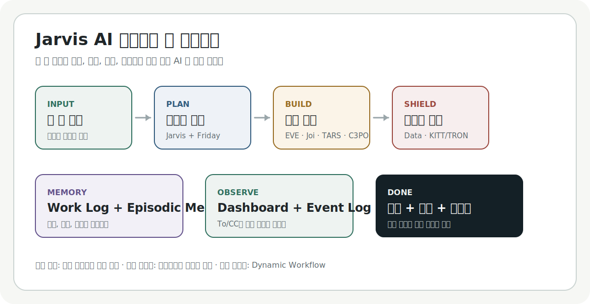

# Jarvis AI 에이전트 팀 운영체계



Jarvis는 한 줄 요청을 `Human Brief`, 전략, 태스크, 실행, 검증, 기억까지 이어 붙이는 로컬 AI 팀 운영 시스템입니다.

**Done은 말로 끝난 상태가 아니라 `검증 + Work Log + Episodic Memory + 운영 게이트 통과` 상태입니다.**

## 처음 30초

| 사용자는 | Jarvis 팀은 | 남는 것 |
| --- | --- | --- |
| 목표를 한 줄로 말합니다 | Jarvis가 전략화하고 Friday가 To/CC로 분해합니다 | Human Brief, 태스크, 산출물 |
| 세부 양식을 몰라도 됩니다 | EVE, Joi, TARS, C3PO가 역할별로 실행합니다 | 리서치, IA·UX, 코드, 카피 |
| 위험한 결정만 승인합니다 | Data, KITT/TRON, Diagnostic Agent가 검증합니다 | 증거, 리스크 판정, Done 이벤트 |

```text
유튜브 쇼핑몰 MVP 기획하고 랜딩 페이지 작업까지 진행해줘.
```

<details>
<summary>한 줄 요청이 어떻게 바뀌는지 보기</summary>

| 변환 단계 | 생성되는 것 |
| --- | --- |
| 요청 이해 | Human Brief 초안, 목표, 성공 기준, 금지 사항 |
| 전략화 | 우선순위, 실행 범위, 차단 리스크 |
| 태스크 분해 | Owner(To), CC, 산출물, 완료 기준 |
| 실행 | 리서치, IA(웹), UX, 코드, 카피, 데이터 분석 |
| 검토 | Risk Shield, 정량 근거, 보안/법무/개인정보 확인 |
| 완료 | 검증 증거, Work Log, Episodic Memory, Done 이벤트 |

</details>

## 바로가기

| 찾는 것 | 링크 |
| --- | --- |
| 상세 사용자 매뉴얼 | [docs/project-user-manual.html](docs/project-user-manual.html) |
| 전체 문서 지도 | [docs/README.md](docs/README.md) |
| Codex 자동 지침 | [AGENTS.md](AGENTS.md) |
| 에이전트 역할표 | [agents/00-agent-management-index.md](agents/00-agent-management-index.md) |
| 로컬 대시보드 HTML | [dashboards/agent-assignment-dashboard.html](dashboards/agent-assignment-dashboard.html) |
| 간단 요청 예시 | [templates/simple-start-request.md](templates/simple-start-request.md) |
| 웹 IA Brief 템플릿 | [templates/ia-brief-template.md](templates/ia-brief-template.md) |
| 요청 상태·IA 게이트 | [docs/request-state-machine.md](docs/request-state-machine.md) |

## 이 프로젝트는 무엇인가

Jarvis는 하나의 AI가 모든 일을 혼자 처리하는 방식이 아니라, 여러 역할의 에이전트가 협업하는 운영 모델입니다. 매뉴얼 기준으로는 **운영 본체**, **관찰 하네스**, **실행 하네스**가 분리되어 있습니다.

| 구성 | 쉽게 말하면 | 대표 파일 |
| --- | --- |
| 운영 본체 | Jarvis 전략화, Friday 태스크 분해, 역할별 실행, Risk Shield, Human Conductor 승인 | [AGENTS.md](AGENTS.md), [skills/agent-team-orchestration/SKILL.md](skills/agent-team-orchestration/SKILL.md) |
| 관찰 하네스 | 현재 요청이 어디까지 왔는지 보여주는 대시보드와 이벤트 로그 | [dashboards/agent-assignment-dashboard.html](dashboards/agent-assignment-dashboard.html), [dashboards/task-events.jsonl](dashboards/task-events.jsonl) |
| 실행 하네스 | 큰 작업을 worker 단위로 나눠 실행하고 검증하는 Dynamic Workflow | [docs/dynamic-workflow.md](docs/dynamic-workflow.md) |
| Agent Brain | 업무 로그, 에피소드 기억, 지혜 승격, 망각 체계 | [memory/](memory/) |

목표는 단순합니다. 사용자가 한 줄로 요청해도 팀이 알아서 문서화, 분해, 실행, 검증, 회고까지 이어가도록 만드는 것입니다.

## 3분 시작

1. 하고 싶은 일을 한 줄로 적습니다.

```text
README를 처음 보는 사람도 이해하기 쉽게 정리해줘.
```

2. 새 작업이면 요청 슬러그를 정하고 시작 훅을 실행합니다.

```powershell
powershell -ExecutionPolicy Bypass -File scripts/start-jarvis-request.ps1 -RequestId <request-slug> -Task "<요청 요약>"
```

3. 반환된 대시보드 URL은 OS 기본 브라우저가 아니라 현재 AI툴 브라우저나 프리뷰에서 엽니다.

4. `work-requests/YYYY-MM-DD-request-slug/` 폴더에 Human Brief, 산출물, 검증 증거를 남깁니다. 웹서비스·랜딩·다페이지 UI 요청이면 Joi가 [IA Brief](templates/ia-brief-template.md)(`ia-brief.md`)를 먼저 작성한 뒤 UX Brief와 구현으로 이어갑니다.

5. 완료 전에는 검증 훅으로 작업 요청 상태를 확인합니다.

```powershell
powershell -ExecutionPolicy Bypass -File scripts/validate-jarvis-request.ps1 -RequestId <request-slug>
```

<details>
<summary><strong>운영 세부 문서 펼쳐보기</strong></summary>

## 상세 매뉴얼

Jarvis 프로젝트의 상세 사용자 매뉴얼은 루트가 아니라 `docs/project-user-manual.html`에서 관리합니다.

- 바로 이동: [상세 사용자 매뉴얼 열기](docs/project-user-manual.html)
- 파일 위치: `docs/project-user-manual.html`
- 내용: 운영 흐름, 화면별 설명, 작업 요청 규칙, 검증 절차

README는 빠른 안내서이고, 실제 사용법의 전체 설명은 [상세 사용자 매뉴얼](docs/project-user-manual.html)을 기준으로 확인합니다.

매뉴얼의 핵심만 압축하면 아래와 같습니다.

| 매뉴얼 섹션 | README 요약 |
| --- | --- |
| 오케스트레이션 적용 확인 | Jarvis의 본체는 역할 라우팅과 승인 흐름이고, 대시보드는 관찰 장치입니다 |
| 빠른 시작 | 사용자는 한 줄로 요청하고, 팀은 Human Brief부터 자동 생성합니다 |
| 제품형 운영 시스템 | 요청은 Intake부터 Done까지 상태 머신과 게이트로 닫힙니다. Medium 이상 웹 작업은 IA Draft 게이트를 거칩니다 |
| 에이전트 운영법 | 에이전트는 기능 목록이 아니라 책임, 권한, 금지 사항을 가진 업무 주체입니다 |
| 표준 업무 흐름 | Kickoff, Execution, Review, Memory and Release 순서로 움직입니다 |
| 리스크 쉴드 | Risk Shield는 속도를 늦추는 장치가 아니라 외부 공개 전 사고를 막는 방어 레이어입니다 |

## 운영 흐름

| 단계 | 하는 일 | 중심 역할 |
| --- | --- | --- |
| 1. 요청 접수 | 사용자의 자연어 요청을 Human Brief 초안으로 바꿈 | Jarvis |
| 2. 전략화 | 목표, 우선순위, 성공 기준, 차단 리스크를 정리 | Jarvis |
| 3. 태스크 분해 | Owner와 CC를 정하고 산출물을 나눔 | Friday |
| 3½. IA Draft | 웹서비스의 사이트맵, 내비, 라벨 사전을 정의 (`ia-brief.md`) | Joi |
| 4. 실행 | 문서, 코드, 디자인, 리서치 작업 수행 | 실무 에이전트 |
| 5. 리스크 검토 | 보안, 개인정보, 법무, 품질 위험 점검 | KITT/TRON, Diagnostic Agent |
| 6. 완료 기록 | 작업 로그, 에피소딕 메모리, 검증 증거 저장 | Jarvis 팀 |

웹서비스·랜딩·다페이지 UI는 Friday가 `TASK-IA → TASK-UX → TASK-WEB` 순으로 분해합니다. Design Review Mode를 쓰는 MVP·고위험 프로젝트는 PRD/TRD 다음 **Information Architecture** 문서(8개 산출물 중 3번)를 포함합니다. 자세한 게이트와 생략 규칙은 [docs/request-state-machine.md](docs/request-state-machine.md), 태스크 체인은 [templates/friday-task-breakdown-template.md](templates/friday-task-breakdown-template.md) §7을 참고합니다.

## 핵심 아키텍처

Jarvis는 항상 다음 4단계 구조를 유지합니다.

| 단계 | 이름 | 의미 |
| --- | --- | --- |
| SYS.01 | Dream Team | 역할 기반 에이전트 팀 |
| SYS.02 | Virtual Office | To/CC 커뮤니케이션과 작업 채널 |
| SYS.03 | Agent Brain | 기억, 회고, 지혜 승격, 망각 체계 |
| SYS.04 | Human Conductor | 인간의 비전, 최종 승인, 코칭, 리스크 승격 |

자세한 계약과 원칙은 [architecture/](architecture/)와 [docs/README.md](docs/README.md)에서 확인합니다.

## 폴더 지도

| 경로 | 역할 |
| --- | --- |
| [docs/](docs/) | PRD, TASK, 사용자 매뉴얼, 운영 문서, 리스크 게이트 |
| [architecture/](architecture/) | 4단계 아키텍처와 운영 계약 |
| [agents/](agents/) | 역할별 에이전트 지침 |
| [skills/](skills/) | Jarvis 팀 운영 스킬과 설계 리뷰 모드 |
| [templates/](templates/) | Human Brief, **IA Brief**, 태스크 분해, 검증, 업무 로그 템플릿 |
| [dashboards/](dashboards/) | 에이전트 분장 대시보드와 작업 이벤트 로그 |
| [work-requests/](work-requests/) | 작업 요청별 자료, 산출물, 검증 증거 |
| [memory/](memory/) | 업무 로그, 에피소딕 메모리, 지혜 후보 |
| [evals/](evals/) | 평가 하네스와 회귀 검증 자료 |
| [scripts/](scripts/) | 작업 시작, 검증, 완료, 감사 자동화 훅 |
| [decisions/](decisions/) | 승인과 의사결정 기록 |
| [assets/](assets/) | 공용 시각 자료와 리소스 |

`stock-auto-trader/`, `hnt_cob-brand/`, `catbook/` 같은 하위 프로젝트와 개인 작업 큐 성격의 폴더는 각 폴더의 전용 README나 작업 요청 문서에서 별도로 관리합니다. `packages/`는 로컬 전용 패키지로 GitHub에 올리지 않습니다.

## 핵심 문서

| 문서 | 언제 읽나 |
| --- | --- |
| [docs/README.md](docs/README.md) | 전체 문서 구조를 찾고 싶을 때 |
| [docs/project-user-manual.html](docs/project-user-manual.html) | Jarvis 사용법을 화면과 흐름 중심으로 보고 싶을 때 |
| [AGENTS.md](AGENTS.md) | Codex와 AI 도구가 따르는 루트 규칙을 확인할 때 |
| [docs/file-management-policy.md](docs/file-management-policy.md) | 원본, 생성물, 임시 로그, 아카이브 기준이 필요할 때 |
| [docs/risk-shield.md](docs/risk-shield.md) | 보안, 개인정보, 릴리스 리스크를 판단할 때 |
| [docs/development-execution-checklist.md](docs/development-execution-checklist.md) | 개발 작업의 실행 체크리스트가 필요할 때 |
| [templates/ia-brief-template.md](templates/ia-brief-template.md) | 웹서비스 정보설계(사이트맵, 내비, 라벨)를 정의할 때 |
| [agents/joi.md](agents/joi.md) | Joi의 IA·UX Brief 산출 형식과 웹 작업 순서를 확인할 때 |
| [docs/workforce-deliverables.md](docs/workforce-deliverables.md) | 역할별 필수 산출물(IA Brief 포함) 기준이 필요할 때 |
| [docs/data-research-tooling-guidelines.md](docs/data-research-tooling-guidelines.md) | Data와 EVE의 데이터, 리서치 작업 기준이 필요할 때 |
| [dashboards/agent-assignment-dashboard.html](dashboards/agent-assignment-dashboard.html) | 역할별 진행 상황을 보고 싶을 때 |

## 안전 규칙

대부분의 문서 수정, 내부 기획, 비파괴적 분석, 코드 리딩은 바로 진행합니다.

다음 작업은 실행 전에 Human Conductor에게 확인하거나 리스크 검토로 올립니다.

| 확인이 필요한 일 | 이유 |
| --- | --- |
| 기존 파일 삭제 또는 대량 이름 변경 | 되돌리기 어렵기 때문 |
| 외부 배포 또는 공개 릴리스 | 사용자와 외부에 직접 영향이 있기 때문 |
| 워크스페이스 밖으로 데이터 전송 | 데이터 노출 위험이 있기 때문 |
| 비밀키, 인증 정보, 결제, 개인정보 처리 | 보안과 법무 리스크가 있기 때문 |
| 프로젝트 방향을 크게 바꾸는 결정 | Human Conductor의 최종 판단이 필요하기 때문 |

## 데이터와 리서치

Data와 EVE는 [docs/data-research-tooling-guidelines.md](docs/data-research-tooling-guidelines.md)를 기준으로 데이터 수집과 분석을 설계합니다.

- Microsoft Clarity와 Google Tag Manager는 행동 데이터 태깅과 실험 설계의 기준 도구로 다룹니다.
- `yt-dlp`는 영상 메타데이터 수집과 리서치 자동화의 기준 도구로 다룹니다.
- 개인정보, 저작권, 외부 전송, 서비스 약관, 자동화 부하 리스크는 KITT/TRON 검토를 거칩니다.

## 문서 작성 원칙

Jarvis 프로젝트에서 사용자가 직접 읽는 Markdown 파일은 가급적 한글로 작성합니다.

코드 식별자, 파일 경로, 명령어, API 이름, 고유명사, 원문 인용, 외부 문서 제목은 필요할 때 원문 표기를 유지할 수 있습니다.

새로운 루트 폴더나 핵심 운영 문서가 추가되면 이 README와 [docs/README.md](docs/README.md)를 함께 갱신합니다.

</details>
