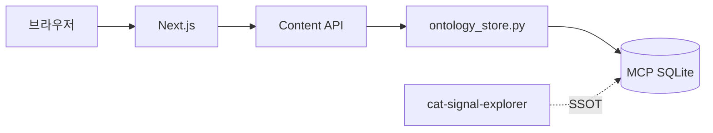

# TRD — 냥톨로지 풀스택 서비스

> requestId: `2026-07-08-nyantology-novice-owner-web-service`  
> **통합 SSOT**: [nyangtology_fullstack_plan_integrated.md](./nyangtology_fullstack_plan_integrated.md) §6~§9  
> 선행: [01-prd.md](./01-prd.md), [00-decision-log.md](./00-decision-log.md)

---

## 1. 아키텍처 개요

### 1-1. Full Service (목표)

```text
[Mobile Web / PWA]
        ↓
[Next.js Frontend]
        ↓
[API Layer]
        ├─ Auth / Cat Profile / Ask / Log / Vet Note / Recommend / Admin
        ↓
[Service Layer]
        ├─ Ontology Resolver (MCP ontology_store → PG sync)
        ├─ Safety Filter (safety.py + safety_audits)
        ├─ RAG Answer Generator (Phase 2+)
        ├─ Recommendation Engine (Phase 3+)
        └─ Content Generator (Phase 4 Admin)
        ↓
[Data Layer]
        ├─ Supabase PostgreSQL + pgvector
        ├─ Supabase Storage (attachments)
        └─ MCP SQLite snapshot (Phase 1 read SSOT)
        ↓
[Admin CMS]
```

### 1-2. Phase 1 (MVP) — 축소 컨텍스트



Phase 2부터 Supabase·Auth·사용자 API 추가. 통합 §6.2 전체는 Phase 4까지 단계 적용.

### 1-3. 기술 스택 (통합 §6.1 + Decision Log)

| 영역 | Full (목표) | Phase 1 MVP |
| --- | --- | --- |
| Frontend | Next.js / React, PWA | Next.js 15 App Router |
| Styling | Tailwind + Framer Motion | CSS Modules + tokens |
| Backend | Next.js API Routes | + Python bridge |
| DB | Supabase PostgreSQL | SQLite read-only |
| Auth | Supabase Auth | 없음 |
| Vector | pgvector | — |
| AI | OpenAI / RAG (노드 통과) | — |
| Storage | Supabase Storage | — |
| Admin | Next.js /admin | — |
| Hosting | Vercel | Vercel |
| Analytics | PostHog | Vercel Analytics |
| Monitoring | Sentry | /api/health |

---

## 2. 모듈 경계 (`catbook/nyangtology-web/`)

```text
catbook/nyangtology-web/
├── docs/                   # 기획 SSOT
├── app/                    # Next.js (Phase 1~)
│   ├── (user)/             # 홈, scenarios, chapters, diary…
│   └── admin/              # Phase 4
├── app/api/
│   ├── health|stats|scenarios|search|concepts/   # Phase 1
│   ├── ask|logs|vet-note|recommendations/        # Phase 2~3
│   └── admin/                                      # Phase 4
├── components/
├── lib/
├── bridge/                 # ontology_store wrapper
└── supabase/migrations/    # Phase 2+
```

---

## 3. API 설계

### 3-1. Phase 1 — Read-only (MCP 대응)

| Method | Path | MCP / 통합 |
| --- | --- | --- |
| GET | `/api/health` | — |
| GET | `/api/stats` | `catbook_ontology_stats` |
| GET | `/api/scenarios` | preset 01 |
| GET | `/api/scenarios/{id}` | neighborhood |
| GET | `/api/search?q=` | `catbook_search_nodes` |
| GET | `/api/concepts/{id}` | node detail |
| GET | `/api/concepts/{id}/evidence` | `catbook_get_evidence` |

### 3-2. Phase 2+ — 사용자 API (통합 §8.1)

| Method | Path | 설명 |
| --- | --- | --- |
| POST | `/api/ask` | 자연어 → scenario/nodes/answer |
| POST | `/api/vet-note` | 세 줄 메모 |
| POST | `/api/logs` | 행동 일기 |
| GET | `/api/recommendations` | cat_id 기반 추천 |
| POST | `/api/environment-check` | 안심 점수 |

### 3-3. Phase 4 — Admin API (통합 §8.2)

`GET/POST/PATCH/DELETE /api/admin/nodes|edges|chapters`  
`POST /api/admin/generate-card|generate-script|safety-check|publish-content`

### 3-4. 응답·캐싱

- Envelope: `{ data, meta: { ontology_version, safety[] } }`
- Phase 1 캐시 TTL: stats/scenarios 300s, concepts 60s
- RAG 응답: `safety_audits` insert (Phase 2+)

---

## 4. AI / RAG (Phase 2+, 통합 §9)

```text
질문 → 의도 분류 → Scenario/Node 검색 → Edge → Safety → 답변 생성
```

**규칙**: 내부 노드만, 건강 비진단, observe 우선, care_action, 기록 양식, 상담 준비 표현.

**RAG 순서**: Scenario → CatSignal/HealthObservation → Environment/Need → CareAction → Chapter → Source → safety rules.

---

## 5. 데이터·SSOT

| 레이어 | SSOT | Phase |
| --- | --- | --- |
| 온톨로지 원본 | `catbook/mcp/content/*.sqlite` | 1~ |
| 런타임 PG | `ontology_nodes`, `ontology_edges` | 2+ (sync) |
| 사용자 | `users`, `cats`, `care_logs`, … | 2+ |

상세: [05-database-design.md](./05-database-design.md)

---

## 6. NFR

| ID | Phase 1 | Full |
| --- | --- | --- |
| NFR-01 API P95 | < 800ms cached | < 500ms |
| NFR-02 LCP | < 2.5s | < 2.0s |
| NFR-06 Privacy | no PII | RLS §12 |

---

## 7. Safety·Security

- MCP `safety.py` + 통합 §5.4 금지/허용 표현
- Phase 2+: Supabase RLS on cats, care_logs, health_observations
- Rate limit: search 60/min; ask 20/min/user

---

## 8. 배포·로드맵 (통합 §15·§16)

| Phase | TRD 마일스톤 |
| --- | --- |
| 1 | SQLite API + MO UI |
| 2 | Supabase + ask + profile + logs + chapters |
| 3 | recommend + env + senior + multi-cat + pgvector |
| 4 | Admin CMS + content gen |
| 5 | PWA app, PDF, family, subscription |

**권장 개발 순서** (통합 §16): 온톨로지 적재 → ask → 프로필 → 일기 → 메모 → 챕터 → 추천 → Admin → 생성도구 → 유료화.

---

## 9. 테스트

| Phase | E2E |
| --- | --- |
| 1 | 홈 → sudden_run → zoomies → evidence |
| 2 | ask "숨어요" → log save → vet-note |
| 3 | recommendations after 3 logs |
| 4 | admin node patch + safety-check |
