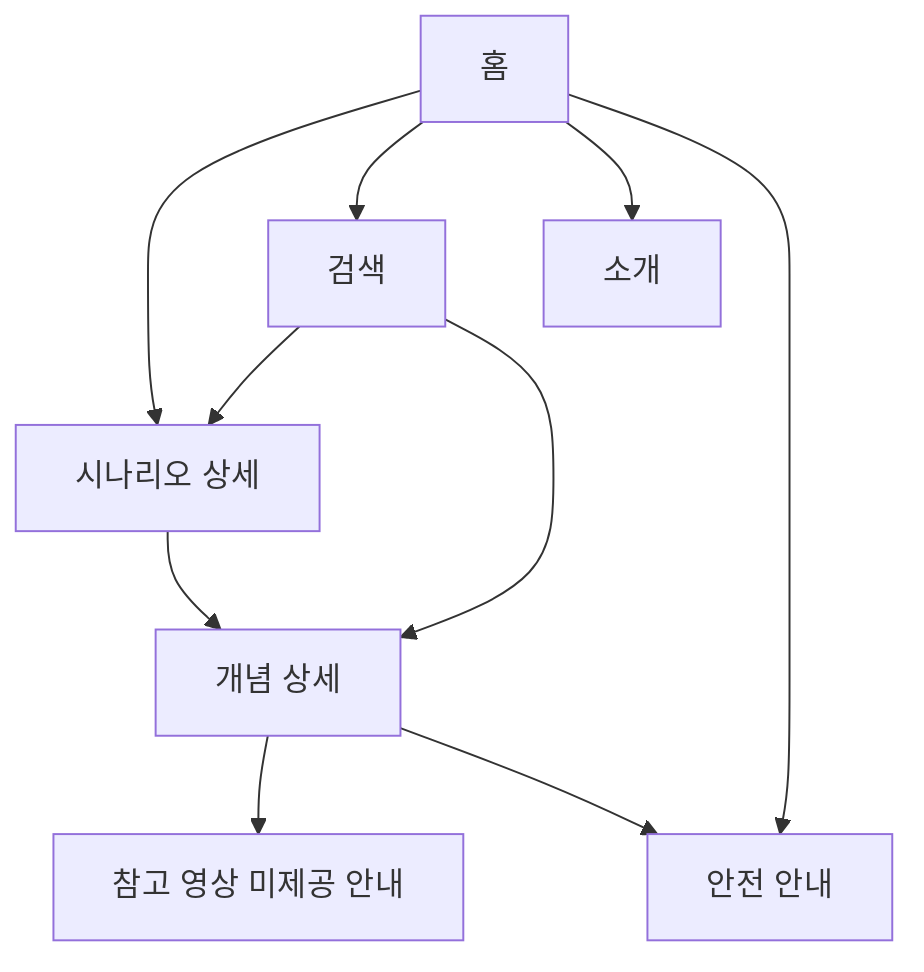

# IA Brief — 냥톨로지 풀스택 서비스

> requestId: `2026-07-08-nyantology-novice-owner-web-service`  
> **통합 SSOT**: [nyangtology_fullstack_plan_integrated.md](./nyangtology_fullstack_plan_integrated.md) §10  
> Owner(To): Joi · CC: TARS, C3PO, Jarvis

---

## 0. 메타

| 항목 | 값 |
| --- | --- |
| requestId | 2026-07-08-nyantology-novice-owner-web-service |
| 프로젝트명 | 냥톨로지 |
| 서비스 유형 | 지식그래프 기반 반려묘 케어 PWA (Phase 1: read-only 탐색) |
| 선행 산출물 | 통합 기획서, PRD, MCP ontology-analysis |
| 후속 산출물 | User Flow, Design System, TARS 구현 |

---

## 1. 목표와 범위

- **IA 목표**: 질문 → 관찰 → 행동 → **기록 → 추천**까지 끊기지 않는 MO-first 탐색 (통합 §0 순환)
- **사용자 Top 4** (통합 §2.1): 초보·다묘·노묘 집사, (Phase 4) 콘텐츠 운영자
- **Phase 1 MVP**: Scenario→신호→관찰 안내, 참고 영상은 미제공 안내 (아래 §2a)
- **Full MO IA** (Phase 2+): 통합 §10.1

### 1-1. Full Mobile IA (Phase 2+, 통합 §10.1)

```text
홈
├─ 질문하기          → /ask (POST 결과)
├─ 오늘의 체크       → 환경 점검 §4.2
├─ 내 고양이         → /cats
├─ 행동 일기         → /diary
├─ 세 줄 메모        → /vet-note
├─ 원고 읽기         → /chapters (42)
├─ 카드뉴스          → /cards
└─ 설정              → /settings
```

---

## 2. 사이트맵

### 2-a. Phase 1 MVP (현재 구현 대상)
├── 홈 (/)
│   ├── 고집사 Hero
│   ├── Scenario 카드 11
│   ├── 인기 질문
│   └── 검색 진입
├── 탐색 (/explore) — 모바일 탭
│   └── Topic/신호 목록 (MVP: Scenario 재노출 + 검색)
├── 시나리오 (/scenarios/{slug})
│   ├── checks
│   ├── 연결 개념
│   └── safety (조건부)
├── 개념 (/concepts/{slug})
│   ├── observe / beginner
│   ├── neighborhood 요약
│   └── 참고 영상 미제공 안내
├── 검색 (/search?q=)
├── 소개 (/about)
├── 안전·이용 (/safety)
└── Footer
    ├── MCP 연결 안내
    └── ontology version
```

### 2-b. Phase 2+ 추가 (통합 §10)

```text
├── 질문 (/ask) — 자연어 입력 → 결과 화면
├── 내 고양이 (/cats/{id})
├── 행동 일기 (/diary)
├── 세 줄 메모 (/vet-note)
├── 원고 (/chapters, /chapters/{slug})
├── 카드 (/cards)
├── 환경 점검 (/environment-check)
├── 노묘 (/senior) · 다묘 (/multi-cat) — Phase 3
└── admin/ — Phase 4
```



---

## 3. 콘텐츠 계층

| 레벨 | 이름 | 설명 | 우선순위 | FEAT |
| --- | --- | --- | --- | --- |
| L1 | 홈 | Scenario 진입 허브 | P0 | FEAT-scenario-home |
| L2 | 시나리오 | checks + 연결 카드 | P0 | FEAT-scenario-detail |
| L2 | 개념 | 신호·욕구·행동·건강관찰 | P0 | FEAT-concept-detail |
| L3 | 참고 영상 | 외부 영상 링크 없이 미제공 안내 | P0 | FEAT-evidence |
| L1 | 안전 | 비진단 정책 | P0 | FEAT-safety |
| L1 | 소개 | 브랜드·MCP | P1 | FEAT-trust |
| L2 | 질문 결과 | ask API 출력 | P1 Phase2 | FEAT-ask |
| L2 | 행동 일기 | care_logs | P1 Phase2 | FEAT-care-log |
| L2 | 챕터 | 42 Chapter | P2 | FEAT-chapter |
| L2 | 카드 | 7종 카드뉴스 | P2 | FEAT-card |

- **홈 즉시 노출**: 고집사 한 줄, Scenario 6종(스크롤), 검색
- **2클릭 이내**: 임의 Scenario → checks + 연결 개념
- **깊이 제한**: 최대 3단계 (홈→시나리오→개념), 참고 영상은 외부 이동 없이 미제공 안내

---

## 4. 내비게이션 모델

| 영역 | 유형 | 항목 | 목적 |
| --- | --- | --- | --- |
| GNB (PC) | 글로벌 | 홈, 탐색, 소개, 안전 | 주요 이동 |
| Bottom Tab (MO) Phase1 | 글로벌 | 홈, 탐색, 안전 | 엄지 도달 |
| Bottom Tab (MO) Phase2+ | 글로벌 | 홈, 일기, 내 고양이, 더보기 | 통합 §10.1 |
| In-page | 탭/앵커 | checks / 연결 / 참고 영상 미제공 | 긴 상세 분할 |
| Utility | 검색 | 헤더 검색 아이콘 | Scenario·Signal |
| Breadcrumb | 경로 | 홈 > 시나리오 > 개념 | PC만 |
| Footer | 보조 | MCP, version, disclaimer | 신뢰 |

- **전략**: **검색 우선 + Scenario 카드 보조** (초보는 질문 문장으로 진입)
- **모바일**: GNB 축소, Bottom Tab 고정; `backdrop-filter` 조상 주의 (nyantology-intro 교훈)
- **숨김**: Source 노드 단독 페이지 없음 (820 Source는 evidence로만)

---

## 5. 라벨 사전

| UI 라벨 | 의미 | 금지 표현 |
| --- | --- | --- |
| 시나리오 | 초보 질문 진입점 | "케이스", "진단" |
| 확인할 것 | checks[] | "증상 확인" |
| 관찰 포인트 | observe[] | "검사 항목" |
| 참고 영상 | 현재 미제공 안내 | "치료법", "처방", 외부 YouTube 링크 |
| 전문가 상담 준비 | CONSULT_WHEN | "지금 병원 가세요" (단정) |
| 고집사 | 안내 톤 | 수의사 persona |
| 냥톨로지 | 서비스명 | catbook (사용자-facing X) |
| 행동 일기 | care_logs 기록 | "증상 일지" |
| 세 줄 메모 | vet-note 3필드 | "진단서" |
| 오늘의 챕터 | Chapter 42 | "레슨" |
| 카드뉴스 | 공유형 이미지 카드 | "밈" |
| 안심 점수 | environment-check | "건강 점수" |

---

## 6. 페이지별 정보 우선순위

### 홈

1. 고집사 + 비진단 한 줄
2. 검색
3. Scenario 카드
4. 인기 질문 링크

### 시나리오 상세

1. 제목 + summary
2. Safety 배너 (조건부)
3. 확인할 것 (checks)
4. 연결된 개념 카드
5. 고집사 코멘트 (1문장)

### 개념 상세

1. class 배지 + label
2. beginner
3. observe chips
4. neighborhood 미니맵
5. 참고 영상 미제공 안내

---

## 7. IA 리스크

| 리스크 | 완화 |
| --- | --- |
| 건강 페이지가 "진단 도구"로 오인 | /safety 링크, 배너, C3PO 검수 |
| Source 820 노드로 IA 폭발 | Source 전용 페이지 금지 |
| 모바일 탭바 viewport 버그 | filter 조상 분리 |

---

## 8. DoD 체크리스트

- [x] 사이트맵 L1~L3 정의
- [x] GNB + Mobile Bottom Tab
- [x] 라벨 사전 8항목+
- [x] 2클릭 상세 탐색 경로 명시
- [x] FEAT/REQ 연결
- [ ] Human Conductor 사이트맵 승인
- [ ] Joi UX Brief (TASK-UX)
