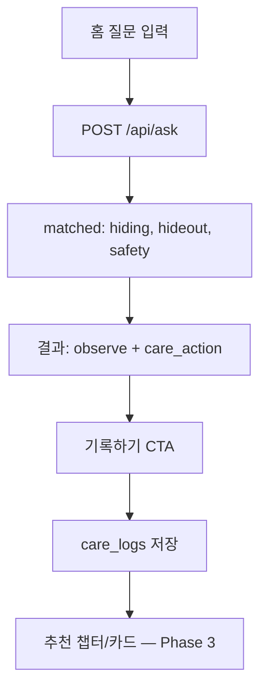

# User Flow — 냥톨로지 풀스택 서비스

> requestId: `2026-07-08-nyantology-novice-owner-web-service`  
> **통합 SSOT**: [nyangtology_fullstack_plan_integrated.md](./nyangtology_fullstack_plan_integrated.md) §2.2·§4·§10

---

## Phase 1 — MVP Flows

### 1. Primary — "갑자기 뛰어요"

```mermaid
flowchart TD
  A[외부 유입] --> B[홈]
  B --> C{진입}
  C -->|Scenario| D[sudden-run]
  C -->|검색| D
  D --> E[checks]
  E --> F[우다다 카드]
  F --> G[zoomies 상세]
  G --> H[참고 영상 미제공 안내]
  D --> K[Safety 배너]
  K --> L[/safety]
```

### 2. 건강 신호 — "화장실이 달라졌어요"

통합 시나리오 B 패턴. Safety 배너 → observe → vet_notes → /safety.

### 3. 검색 실패

0건 → 고집사 대안 표현 → 인기 질문 10.

---

## Phase 2+ — Full Service Flows

### 4. 신호 번역기 — "고양이가 숨어요" (통합 §4.1·§2.2 A)



**출력 영역**: 가능한 신호 · 관찰할 것 · 관련 환경 · 집사 행동 · 기록 안내 · 관련 원고 · 카드

### 5. 행동 일기 (§4.4)

```text
오늘 행동 선택 → 전후 맥락 → 집사 행동 → 저장 → 패턴 요약(Phase 3)
```

### 6. 세 줄 메모 (§4.5)

```text
언제/무엇/얼마나 입력 → memo 생성 → (선택) 사진·PDF·가족 공유 Phase 5
```

### 7. 환경 점검 (§4.2)

```text
7항목 체크 → 안심 점수 72 → 개선 우선순위 3건
```

### 8. 노묘 / 다묘 (§4.6·§4.7)

전용 체크리스트 → 주간 리포트 → 세 줄 메모 초안.

---

## Key Screens

| Screen | Phase | Route | REQ |
| --- | --- | --- | --- |
| Home | 1 | `/` | REQ-001 |
| ScenarioDetail | 1 | `/scenarios/{slug}` | REQ-002 |
| ConceptDetail | 1 | `/concepts/{slug}` | REQ-003 |
| AskResult | 2 | `/ask` | REQ-101 |
| CatProfile | 2 | `/cats` | REQ-102 |
| Diary | 2 | `/diary` | REQ-103 |
| VetNote | 2 | `/vet-note` | REQ-104 |
| ChapterReader | 2 | `/chapters/{slug}` | REQ-105 |
| CardFeed | 2 | `/cards` | EPIC-7 |
| EnvCheck | 3 | `/environment-check` | REQ-202 |
| Admin | 4 | `/admin` | REQ-301 |

---

## Edge Cases

| Case | Behavior |
| --- | --- |
| ask 미매칭 | 인기 Scenario + 온톨로지 보강 큐 (통합 §14.2) |
| medical ask | safety_audits + 비진단 템플릿 §9.4 |
| unauthenticated diary | 로그인 유도 (Phase 2) |

---

## Metrics (통합 §14)

| Event | Phase |
| --- | --- |
| `ask_submit` | 2+ |
| `care_log_save` | 2+ |
| `vet_note_create` | 2+ |
| `card_share` | 2+ |
| `home_scenario_click` | 1 |
| `concept_evidence_click` | 1 |
