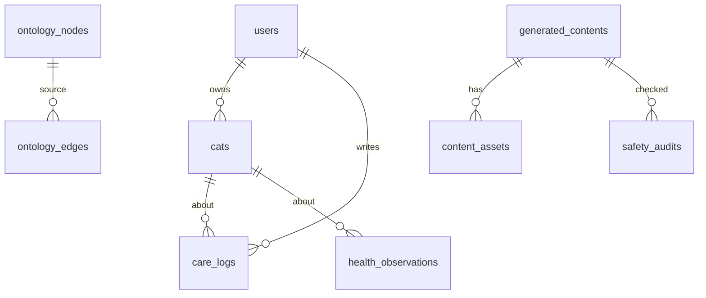

# Database Design — 냥톨로지 풀스택 서비스

> requestId: `2026-07-08-nyantology-novice-owner-web-service`  
> **통합 SSOT**: [nyangtology_fullstack_plan_integrated.md](./nyangtology_fullstack_plan_integrated.md) §7·§12

---

## 1. 설계 원칙

**Dual SSOT**

| Phase | 온톨로지 | 사용자 데이터 |
| --- | --- | --- |
| 1 (MVP) | MCP SQLite read-only | 없음 |
| 2+ | SQLite → **PG sync** (`ontology_*`) | Supabase + **RLS** |
| 3+ | + pgvector embeddings | 추천·패턴 |

---

## 2. MCP SQLite (Phase 1 SSOT)

기존 ERD·클래스·관계 — 변경 없음. `catbook/mcp/content/data/catbook_ontology.sqlite`.

| class_id | nodes | UI Phase |
| --- | ---: | --- |
| Scenario | 12 | 1 |
| CatSignal | 11 | 1 |
| Chapter | 42 | 2 |
| BookPart | 7 | 2 |
| Source | 820 | 1 (evidence) |

---

## 3. Supabase PostgreSQL (Phase 2+, 통합 §7)

### 3-1. ERD 개요



### 3-2. users

```sql
create table users (
  id uuid primary key default gen_random_uuid(),
  email text unique not null,
  nickname text,
  created_at timestamptz default now()
);
```

### 3-3. cats (통합 §4.3)

```sql
create table cats (
  id uuid primary key default gen_random_uuid(),
  user_id uuid references users(id),
  name text not null,
  birth_year int,
  sex text,
  breed text,
  is_senior boolean default false,
  personality_tags jsonb default '[]',
  created_at timestamptz default now()
);
```

### 3-4. ontology_nodes / ontology_edges

MCP SQLite → PG 적재. 스키마는 통합 §7.3·§7.4.

```sql
create table ontology_nodes (
  id uuid primary key default gen_random_uuid(),
  node_id text unique not null,
  class_id text not null,
  label text not null,
  summary text,
  beginner text,
  observe jsonb default '[]',
  keywords jsonb default '[]',
  medical boolean default false,
  evidence_count int default 0,
  created_at timestamptz default now(),
  updated_at timestamptz default now()
);

create table ontology_edges (
  id uuid primary key default gen_random_uuid(),
  source_node_id text not null,
  target_node_id text not null,
  relation_id text not null,
  label text,
  confidence text,
  safety text,
  created_at timestamptz default now()
);
```

### 3-5. scenarios

```sql
create table scenarios (
  id uuid primary key default gen_random_uuid(),
  scenario_id text unique not null,
  label text not null,
  description text,
  start_node_ids jsonb default '[]',
  created_at timestamptz default now()
);
```

### 3-6. care_logs (통합 §4.4)

```sql
create table care_logs (
  id uuid primary key default gen_random_uuid(),
  user_id uuid references users(id),
  cat_id uuid references cats(id),
  log_type text,
  observed_signal text,
  context_before text,
  context_after text,
  appetite_status text,
  water_status text,
  litter_status text,
  energy_status text,
  care_action text,
  memo text,
  created_at timestamptz default now()
);
```

### 3-7. health_observations (세 줄 메모, §4.5)

```sql
create table health_observations (
  id uuid primary key default gen_random_uuid(),
  user_id uuid references users(id),
  cat_id uuid references cats(id),
  observation_type text,
  started_at_text text,
  what_changed text,
  degree_text text,
  attachments jsonb default '[]',
  consult_ready boolean default false,
  created_at timestamptz default now()
);
```

### 3-8. Admin·콘텐츠 (Phase 4)

- `memo_templates` — §7.8
- `generated_contents` — §7.9
- `content_assets` — §7.10
- `safety_audits` — §7.11

### 3-9. RLS (통합 §12.2)

```sql
alter table cats enable row level security;
alter table care_logs enable row level security;
alter table health_observations enable row level security;
-- policy: auth.uid() = user_id
```

---

## 4. pgvector (Phase 3+)

- `ontology_nodes.embedding vector(1536)` — Chapter/Signal 검색
- RAG: Scenario label → node → edge traverse → safety

---

## 5. Slug·Cache·Sync

- Slug: `nodeIdToSlug()` — Phase 1 동일
- Cache keys: Phase 1 TTL 표 유지
- Sync job: MCP hash → `deploy_snapshots` → PG upsert ontology_*

---

## 6. Analytics (optional)

`page_events`, `feature_flags` — Phase 1.5 익명 CTR.

---

## 7. 민감도 (통합 §12.1)

| 데이터 | 등급 | 보호 |
| --- | --- | --- |
| email | PII | Auth only |
| cats | PII | RLS |
| care_logs | 행동 | RLS |
| health_observations | **민감** | RLS + 암호화 검토 |
| attachments | 민감 | Storage ACL |
