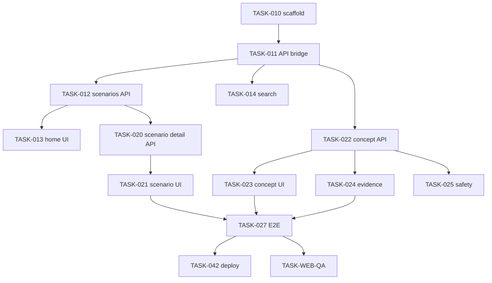

# TASKS — 냥톨로지 풀스택 서비스

> requestId: `2026-07-08-nyantology-novice-owner-web-service`  
> **통합 SSOT**: [nyangtology_fullstack_plan_integrated.md](./nyangtology_fullstack_plan_integrated.md) §15·§16  
> Friday 분해 · SSOT: [01-prd.md](./01-prd.md), [02-trd.md](./02-trd.md)

---

## 0. 메타

| 항목 | 값 |
| --- | --- |
| 프로젝트 | 냥톨로지 풀스택 |
| Phase 1 | read-only MVP (P0) |
| Phase 2~5 | 통합 기획 로드맵 |
| 상태 | Phase 0 Done → Phase 1 read-only MVP 구현·배포 완료 |

---

## 1. EPIC ↔ TASK 매트릭스

| EPIC | FEAT | Task IDs |
| --- | --- | --- |
| EPIC-1 질문 탐색 | FEAT-scenario-home | TASK-010~014 |
| EPIC-2 맥락·근거 | FEAT-scenario-detail, concept, evidence notice | TASK-020~027 |
| EPIC-3 안전·신뢰 | FEAT-safety, trust | TASK-030~034 |
| EPIC-4 운영 | FEAT-ops | TASK-040~043 |
| 횡단 | IA/UX/QA·이미지 | TASK-IA, TASK-UX, TASK-035, TASK-WEB-QA |

---

## 2. Phase 0 — 기획·게이트 (완료)

| Task ID | 태스크명 | Owner | 상태 | 산출물 |
| --- | --- | --- | --- | --- |
| TASK-001 | Decision Log + MVP 캡슐 | Jarvis | **Done** | 00-decision-log.md |
| TASK-002 | PRD 6섹션 | Jarvis, C3PO | **Done** | 01-prd.md |
| TASK-003 | TRD + API 스펙 | TARS | **Done** | 02-trd.md |
| TASK-IA | IA Brief | Joi | **Done** | 03-ia-brief.md |
| TASK-004 | User Flow | Joi | **Done** | 04-user-flow.md |
| TASK-005 | DB Design | TARS, Data | **Done** | 05-database-design.md |
| TASK-006 | Design System | Joi | **Done** | 06-design-system.md |
| TASK-007 | TASKS 문서 | Friday | **Done** | 07-tasks.md (본 문서) |
| TASK-008 | Coding Guide | TARS | **Done** | 08-coding-convention-ai-guide.md |
| TASK-009 | 통합 기획서 반영·docs 동기화 | Jarvis, Friday | **Done** | nyangtology_fullstack_plan_integrated.md → 00~08 갱신 |

**게이트**: Human OQ-01~04 → Phase 1 TASK-010 착수

---

## 3. Phase 1 — 수직 슬라이스 (P0)

### TASK-010 — Repo 스캐폴드

| 필드 | 내용 |
| --- | --- |
| Owner | TARS |
| CC | Jarvis, Friday |
| 선행 | TASK-008, Human 스택 승인 |
| 산출물 | `catbook/nyangtology-web/` Next.js app skeleton |
| 완료 기준 | `pnpm dev` 로컬 기동, ESLint pass |
| 하지 말 것 | ontology 로직 Node 재작성 |

### TASK-011 — Python ontology API bridge

| 필드 | 내용 |
| --- | --- |
| Owner | TARS |
| CC | KITT/TRON |
| 선행 | TASK-010 |
| 산출물 | `/api/stats`, `/api/scenarios`, `/api/health` |
| 완료 기준 | smoke: stats nodes=956; MCP `catbook_ontology_stats`와 일치 |
| 검증 | `python catbook/mcp/smoke_test.py` + API contract test |

### TASK-012 — Scenario list API + slug

| 필드 | 내용 |
| --- | --- |
| Owner | TARS |
| 선행 | TASK-011 |
| 산출물 | GET `/api/scenarios`, slug mapper |
| 완료 기준 | 11 Scenario JSON; id `scenario:sudden_run` 포함 |

### TASK-013 — 홈 UI

| 필드 | 내용 |
| --- | --- |
| Owner | TARS |
| CC | Joi, C3PO |
| 선행 | TASK-012, TASK-IA |
| 산출물 | `app/page.tsx`, 고집사 안내, 검색 진입, 인기 질문, How it helps, 안전 메모 |
| 완료 기준 | Design System 토큰; 홈의 상황별 카드 영역은 `/explore` 책임으로 분리; MO/PC 390/1440 스크린샷 |
| REQ | REQ-001 |

### TASK-014 — 검색 API + UI

| 필드 | 내용 |
| --- | --- |
| Owner | TARS |
| CC | EVE |
| 선행 | TASK-011 |
| 산출물 | `/api/search`, `/search` page |
| 완료 기준 | "하악" → Scenario 또는 CatSignal ≥1 |
| REQ | REQ-001 |

---

## 4. Phase 2 — 상세·근거 (P0)

### TASK-020 — Scenario detail API

| Owner | TARS |
| 선행 | TASK-012 |
| 산출물 | GET `/api/scenarios/{id}` — checks, linked nodes depth 1 |
| 완료 기준 | sudden_run checks 3개; edges STARTS_WITH |
| REQ | REQ-002 |

### TASK-021 — Scenario detail UI

| Owner | TARS · CC Joi |
| 선행 | TASK-020, TASK-013 |
| 산출물 | `app/scenarios/[slug]/page.tsx` |
| 완료 기준 | checks UI, ConceptCard grid, breadcrumb PC |
| REQ | REQ-002 |

### TASK-022 — Concept detail API

| Owner | TARS |
| 선행 | TASK-011 |
| 산출물 | `/api/concepts/{id}`, neighborhood, evidence 메타 |
| 완료 기준 | signal:zoomies beginner + observe + evidence_count |
| REQ | REQ-003 |

### TASK-023 — Concept detail UI

| Owner | TARS · CC Joi, C3PO |
| 선행 | TASK-022 |
| 산출물 | `app/concepts/[slug]/page.tsx` |
| REQ | REQ-003 |

### TASK-024 — 참고 영상 미제공 UI

| Owner | TARS |
| 선행 | TASK-022 |
| 산출물 | 개념 상세의 참고 영상 미제공 안내 카드 |
| 완료 기준 | YouTube 외부 링크·영상 카드 미노출; `참고 영상` 섹션은 `미제공` 배지와 안내 문구만 표시 |
| REQ | REQ-004 |

### TASK-025 — Safety banner component

| Owner | TARS · CC KITT/TRON, C3PO |
| 선행 | TASK-022 |
| 산출물 | SafetyBanner, API meta.safety |
| 완료 기준 | health:litter_change 페이지 alert role |
| REQ | REQ-005 |

### TASK-026 — CONSULT_WHEN CTA

| Owner | C3PO · CC TARS |
| 선행 | TASK-022 |
| 산출물 | "상담 준비" 카드 copy (비단정) |
| REQ | REQ-005 |

### TASK-027 — E2E 수직 슬라이스

| Owner | TARS · CC Friday |
| 선행 | TASK-021, TASK-023, TASK-024 |
| 산출물 | Playwright: 홈→sudden_run→zoomies→참고 영상 미제공 안내 확인 |
| 완료 기준 | green CI |

---

## 5. Phase 3 — 신뢰·운영 (P1)

### TASK-030 — /about, /safety 정적 페이지

| Owner | C3PO, TARS |
| REQ | REQ-006 |

### TASK-031 — Mobile Bottom Tab

| Owner | Joi, TARS |
| 선행 | TASK-013 |
| 완료 기준 | 390px tab fixed; filter ancestor 없음 |

### TASK-032 — SEO + OG

| Owner | TARS |
| REQ | REQ-008 |

### TASK-033 — C3PO safety copy audit

| Owner | C3PO · CC KITT/TRON |
| 완료 기준 | PRD POL-01~05 UI 반영 체크리스트 sign-off |

### TASK-034 — TASK-UX User Flow wire (선택)

| Owner | Joi |
| 선행 | TASK-IA |
| 산출물 | Figma or HTML wire (3 screens) |

### TASK-035 — 관련 콘텐츠 이미지 생성 (Codex 이미지 스킬)

| 필드 | 내용 |
| --- | --- |
| Owner | Joi |
| CC | TARS, C3PO, Friday |
| 선행 | TASK-006 (Design System), PRD §6-1 IMG-xx |
| Primary Skills | `high-end-visual-design`, `imagegen-frontend-web`, `imagegen-frontend-mobile`, (구현 시) `image-to-code`, (OG) `brandkit` |
| Skill SSOT | `docs/design-taste-skill-guide.md`, `.agents/skills/*/SKILL.md` |
| 산출물 | `catbook/nyangtology-web/artifacts/images/{section-slug}/`, `catbook/nyangtology-web/artifacts/images/image-brief.md` |
| 완료 기준 | PRD IMG-01(P0) Hero 1장 이상; **섹션 1개 = 이미지 1장** 규칙 준수; Design Read 1줄 Work Log 기록 |
| 하지 말 것 | YouTube 썸네일 AI 재생성; 의료·진단 연상 일러스트; 다중 섹션 단일 압축 이미지 |
| REQ | REQ-001, REQ-006, REQ-008 |

**실행 순서**

1. `imagegen-frontend-web` — 홈 Hero(IMG-01), 필요 시 about(IMG-02) **각각 별도 생성**
2. (P1) `imagegen-frontend-mobile` — 모바일 홈·탭바 comp(IMG-03)
3. (P1) `brandkit` — OG 1200×630(IMG-04)
4. TARS: 승인된 comp → `image-to-code` 또는 `high-end-visual-design`로 TASK-013/030 UI 반영
5. `scripts/invoke-jarvis-agent.ps1 -Skill imagegen-frontend-web` 이벤트 기록 (선택)

### TASK-040 — CI ontology hash gate

| Owner | TARS |
| 산출물 | pipeline step: snapshot hash == MCP package |

### TASK-041 — Cache layer

| Owner | TARS |
| NFR | NFR-01 |

### TASK-042 — Vercel preview deploy

| Owner | TARS |
| 선행 | TASK-027, Human Conductor 승인 |
| 가드레일 | production은 Human 명시 승인 |

### TASK-043 — Analytics (익명)

| Owner | Data |
| 산출물 | page_events or Vercel Analytics mapping NS-01 |

---

## 6. Phase 4 — QA·완료 (P0)

### TASK-WEB-QA — IA/UX 검수

| Owner | Joi |
| CC | TARS, Friday |
| 선행 | TASK-027 |
| 산출물 | ui-review.md |
| 완료 기준 | IA DoD + Design pre-flight 전항 pass |

### TASK-050 — validate-jarvis-request

```powershell
powershell -ExecutionPolicy Bypass -File scripts/validate-jarvis-request.ps1 -RequestId 2026-07-08-nyantology-novice-owner-web-service
```

### TASK-051 — Work Log + Episodic Memory

| Owner | Jarvis |
| 선행 | TASK-WEB-QA |

---

## 7. 의존성 그래프 (요약)



---

## 8. 스프린트 제안 (4주)

| 주 | 목표 | Tasks |
| --- | --- | --- |
| W1 | API + 홈 + Hero 이미지 | 010–014, 035(IMG-01), 011 |
| W2 | 시나리오·개념 | 020–025 |
| W3 | E2E + 정적 + MO tab | 026–027, 030–032 |
| W4 | QA + deploy prep | 033, 040–043, WEB-QA, 050–051 |

---

## 9. 리스크·승격

| Task | Risk | 승격 조건 |
| --- | --- | --- |
| TASK-042 | 외부 배포 | Human Conductor |
| TASK-043 | analytics PII | KITT review |
| Phase 2 observation log | 건강 데이터 | 별도 L2 + KITT |

---

## 10. 보고 포맷 (Friday)

```text
To: Friday
CC: Jarvis, TARS
Subject: [TASK-0xx] 완료 보고

결과:
근거:
산출물:
리스크:
다음 액션:
```

---

## 11. Phase 2~5 — Full Service 백로그 (통합 §15·§16)

> 상세 스펙: [nyangtology_fullstack_plan_integrated.md](./nyangtology_fullstack_plan_integrated.md). Human/KITT 승인 후 착수.

### Phase 2 — 사용자 기능

| Task ID | 태스크명 | Owner | REQ | 선행 |
| --- | --- | --- | --- | --- |
| TASK-100 | Supabase schema + RLS | TARS | REQ-102 | Phase 1 Done |
| TASK-101 | ontology SQLite→PG sync | TARS | D-03 | TASK-100 |
| TASK-102 | POST `/api/ask` + ask UI | TARS, C3PO | REQ-101 | TASK-101 |
| TASK-103 | Auth + cats CRUD | TARS | REQ-102 | TASK-100 |
| TASK-104 | care_logs API + diary UI | TARS, Joi | REQ-103 | TASK-103 |
| TASK-105 | vet-note API + UI | TARS, C3PO | REQ-104 | TASK-103 |
| TASK-106 | Chapter reader 42 | TARS, Joi | REQ-105 | TASK-101 |
| TASK-107 | 초보 집사 준비 10 | C3PO, Joi | REQ-106 | TASK-101 |

**진행 메모 — 2026-07-08**: `POST /api/ask` + `/ask` UI는 사용자 저장 없이 SQLite ontology bridge를 직접 사용하는 read-only 세로 슬라이스로 선구현했다. TASK-102의 최종 Phase 2 범위인 Supabase 사용자 맥락, 기록 저장, RAG hardening은 TASK-100~101 이후 별도 게이트로 남긴다.

### Phase 3 — 개인화

| Task ID | 태스크명 | Owner | REQ |
| --- | --- | --- | --- |
| TASK-200 | recommendations engine | TARS, Data | REQ-201 |
| TASK-201 | environment-check + score | TARS | REQ-202 |
| TASK-202 | senior mode UI | Joi, TARS | REQ-203 |
| TASK-203 | multi-cat mode | Joi, TARS | REQ-204 |
| TASK-204 | pgvector + RAG hardening | TARS | REQ-205 |

### Phase 4 — Admin CMS

| Task ID | 태스크명 | Owner | REQ |
| --- | --- | --- | --- |
| TASK-300 | Admin nodes/edges CRUD | TARS | REQ-301 |
| TASK-301 | generate-card/script/FAQ | TARS, C3PO | REQ-302 |
| TASK-302 | safety-check + publish | KITT, TARS | REQ-303 |
| TASK-303 | content pipeline §11 | TARS | REQ-304 |

### Phase 5 — 확장·BM

| Task ID | 태스크명 | Owner | 비고 |
| --- | --- | --- | --- |
| TASK-400 | PWA manifest + offline | TARS | 통합 §15 Phase 5 |
| TASK-401 | PDF report | TARS | 유료 |
| TASK-402 | family share | TARS | KITT |
| TASK-403 | subscription + B2B API | Jarvis, Human | §13 |

### Phase 2+ 이미지 (Codex)

| Task ID | 자산 | Skill |
| --- | --- | --- |
| TASK-210 | 카드뉴스 7종 템플릿 | `imagegen-frontend-web`, `brandkit` |
| TASK-211 | 챕터 매거진 커버 | `imagegen-frontend-mobile` |

---

## 12. 통합 §16 개발 순서 매핑

| 순서 | 통합 §16 | Task |
| --- | --- | --- |
| 1 | 온톨로지 DB 적재 | TASK-101 |
| 2 | 질문→노드 API | TASK-102 (Phase1: TASK-011~014) |
| 3 | 사용자/고양이 프로필 | TASK-103 |
| 4 | 행동 일기 | TASK-104 |
| 5 | 세 줄 메모 | TASK-105 |
| 6 | 원고 챕터 | TASK-106 |
| 7 | 추천 엔진 | TASK-200 |
| 8 | Admin CMS | TASK-300~303 |
| 9 | 콘텐츠 생성 | TASK-301 |
| 10 | 유료화 | TASK-403 |
