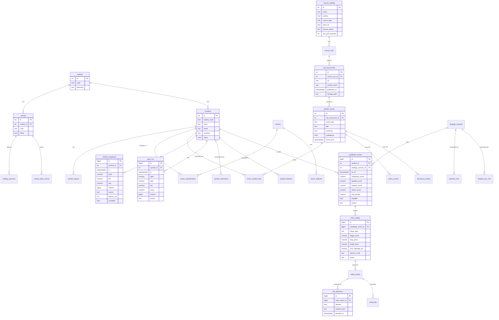

# Stock Auto Trader 고도화 검토: 24시간 스킬 모니터링 및 종목 선정 DB 설계

작성일: 2026-05-22  
범위: `stock-auto-trader` 고도화 검토, 실시간 리서치/정책/섹터 모니터링, 미국 기준 매매 기법 모듈화, 빠른 종목 선정 및 진입 판단용 데이터베이스 설계

## 1. 결론

현재 `stock-auto-trader`는 페이퍼 트레이딩 우선 MVP로 안전하게 시작되어 있다. 실거래 주문, 인증 정보, 비공식 API, 화면 스크래핑을 차단하고 있으며, 정적 리서치 레지스트리와 실시간 데이터 품질 게이트의 골격은 이미 존재한다.

고도화 방향은 단일 에이전트에게 "시장 감시와 매매 판단 전체"를 맡기는 방식이 아니라, 역할별 스킬을 독립 프로세스로 분리하고 24시간 이벤트를 누적하는 방식이 맞다. 특히 정책/지원 뉴스, 공시, 거래소 상태, 섹터 로테이션, 실시간 가격 품질, 후보 종목 랭킹, 주문 가능성, 리스크 게이트는 서로 다른 주기와 실패 모드를 갖기 때문에 스킬 단위로 분리해야 한다.

실거래 전까지 목표는 자동매매가 아니라 `shadow-live`까지다. 즉, 실제 주문은 내지 않고 동일한 입력과 리스크 게이트로 후보 선정, 주문 의도, 차단 사유, 가상 체결, 사후 성과를 누적 검증한다.

## 2. 현재 구현 진단

### 이미 좋은 점

- `README.md`와 `docs/auto-trader-mvp.md`가 실거래 차단, 수익 보장 금지, 토스증권 placeholder 유지 원칙을 명확히 둔다.
- `jarvis_trader/realtime_data.py`는 가격, bid/ask, volume, source, latency를 가진 스냅샷과 freshness/spread/latency 게이트를 제공한다.
- `jarvis_trader/research.py`는 OpenDART, KRX Data Marketplace, SEC EDGAR, broker placeholder를 공식 소스 후보로 등록한다.
- `jarvis_trader/risk.py`는 일일 손실, 목표 도달 후 신규 주문 중단, 포지션/주문 비중, 숏 차단, kill switch를 지원한다.
- `jarvis_trader/market_router.py`와 `market_hours.py`는 KR/US 시간대와 확장장 허용 여부를 분리한다.
- 현재 테스트는 12개이며, 리스크/리서치/실시간 데이터/시장 라우팅/백테스트 기본 동작을 통과한다.

### 고도화 전 보완해야 할 점

- 데이터 저장소가 인메모리라 24시간 운영, 장애 복구, 후보 종목 랭킹 재현, 감사 로그에 부족하다.
- 리서치 엔진은 수동 `ResearchItem` 입력을 요약하는 단계이며 실제 수집기, 중복 제거, 원문 보존, 근거 링크, 이벤트-종목 매핑이 없다.
- 전략은 이동평균 모멘텀 한 가지라 정책/섹터/공시/마켓 마이크로스트럭처를 반영하지 못한다.
- 미국 데이 트레이딩 마진 규칙은 2026-06-04부터 FINRA 새 intraday margin 표준으로 전환되므로, 기존 PDT 전제와 새 규칙을 날짜/브로커별로 분기해야 한다.
- KRX 실시간 데이터, Nextrade, 미국 확장장/overnight, 브로커 API는 모두 약관/라이선스/지원 범위를 확인한 뒤 연결해야 한다.

## 3. Decision Log

```text
{D-001, 운영 모델, "스킬 기반 24시간 모니터링", "데이터 주기와 리스크가 다른 일을 단일 에이전트에 합치면 원인 추적과 검증이 어려움", "스킬별 장애 격리와 감사 가능성 상승", "대안: 단일 슈퍼 에이전트", "보류: 실거래 주문 자동화"}

{D-002, 데이터 저장 전략, "이벤트 소싱 + 최신 랭킹 캐시", "원문 이벤트와 후보 점수 산출 근거를 재현해야 함", "빠른 종목 선정과 사후 감사 동시 확보", "대안: 최신 스냅샷만 저장", "보류: 초저지연 HFT형 구조"}

{D-003, 미국 규칙 처리, "FINRA intraday margin 전환 플래그 도입", "2026-06-04 발효, 2027-10-20까지 브로커 phase-in 가능", "PDT/$25k 하드코딩 방지", "대안: 현재 FINRA 투자자 페이지만 기준", "보류: 법률 판단 자동화"}

{D-004, 실거래 범위, "shadow-live까지만 자동화", "계좌/키/주문은 High 리스크", "데이터와 전략 검증은 가능하되 자금 손실을 차단", "대안: 즉시 broker adapter 구현", "보류: Human Conductor 실거래 승인"}

{D-005, 리서치 근거, "공식/라이선스 소스 우선", "정책/공시/거래소 상태는 오보와 지연의 비용이 큼", "근거 링크와 원문 해시를 저장", "대안: 뉴스/커뮤니티 우선 수집", "보류: 유료 데이터 계약"}
```

## 4. 4단계 아키텍처 보존

- SYS.01 Dream Team: Jarvis는 전략/승격 판단, Friday는 운영 큐, EVE는 정책/공시 리서치, Data는 피처와 랭킹, TARS는 수집기/DB/검증, KITT/TRON은 약관/보안/규제 게이트, Diagnostic Agent는 드리프트와 과최적화를 점검한다.
- SYS.02 Virtual Office: 모든 스킬은 `To/CC`, `source_run_id`, `event_id`, `decision_id`를 남긴다. "왜 후보가 올라왔는지"를 대시보드와 로그에서 역추적 가능해야 한다.
- SYS.03 Agent Brain: 원문 이벤트, 피처, 성과, 실패/차단 사유를 기억 후보로 저장하되, 개인정보/계좌/비밀키는 저장하지 않는다.
- SYS.04 Human Conductor: 실거래, 브로커 키, 유료 데이터 계약, 외부 배포, 큰 전략 변경은 승인 전 차단한다.

## 5. 24시간 스킬 정의

| Skill ID | 이름 | Owner | 주기 | 입력 | 출력 | 차단 조건 |
| --- | --- | --- | --- | --- | --- | --- |
| SKILL-01 | Policy Sentinel | EVE | 15분-1시간 | FSC/FSS/KRX/Nextrade, Federal Register, Grants.gov, Fed, SEC/FINRA, 부처 보도자료 | `policy_events`, `sector_policy_impacts` | 출처 불명, 원문 링크 없음, 약관 위반 |
| SKILL-02 | Disclosure Watch | EVE | 1-5분, rate limit 준수 | OpenDART, SEC EDGAR | `disclosure_events`, `issuer_event_links` | EDGAR 10 req/sec 초과, DART 키/약관 미확인 |
| SKILL-03 | Market Structure Guard | KITT/TRON | 10-60초 | NYSE/Nasdaq/KRX/NXT 세션, halt, LULD, Reg SHO, 공매도 제한 | `market_state`, `symbol_restrictions` | 거래정지/SSR/장외 세션 위험 미반영 |
| SKILL-04 | Realtime Data Quality | Data | 1-5초 | quote/trade/bar, latency, provider heartbeat | `market_snapshots`, `data_quality_reports` | stale, wide spread, latency 초과 |
| SKILL-05 | Sector Radar | Data | 1-5분 | 섹터 ETF, breadth, relative strength, policy tags | `sector_scores` | 섹터 분류 불명, 시장 전체 급락 |
| SKILL-06 | Catalyst Mapper | EVE/Data | 1-15분 | 공시, 실적, 가이던스, 정책, 보조금, 수주, 리콜, 규제 | `catalyst_events`, `event_features` | 근거 부족, 루머성 데이터 |
| SKILL-07 | Setup Ranker | Data | 5-30초 | 가격/거래량/섹터/이벤트/리스크 피처 | `candidate_scores`, `watchlist_snapshots` | 데이터 품질 실패, 후보 과밀 |
| SKILL-08 | Execution Planner | TARS | 1-5초 | 후보 점수, 호가, 세션, 스프레드, 슬리피지 | `entry_setups`, `order_intents` | 확장장 market order, 호가 공백, 부분체결 모델 없음 |
| SKILL-09 | Risk Shield | KITT/TRON | 주문 의도마다 | portfolio, margin, restrictions, confidence, drawdown | `risk_decisions`, `kill_switch_events` | 실거래 승인 없음, 손실/마진/규제 게이트 실패 |
| SKILL-10 | Backtest and Shadow Lab | Data/TARS | 장마감/주말 | historical bars, candidate history, virtual fills | `strategy_metrics`, `shadow_live_runs` | out-of-sample 실패, 과최적화 징후 |
| SKILL-11 | Diagnostic Drift Check | Diagnostic Agent | 매일/주간 | 성과, 차단 사유, 신호 분포, 변경 이력 | `drift_reports` | 근거 없는 성공 보고, 전략 drift |

권장 운영 주기:

- 00:00-24:00: 정책/공시/지원사업/거래소 상태 수집은 계속 유지한다.
- 미국 04:00-20:00 ET: 실시간 후보 랭킹과 shadow-live를 강화한다. Extended hours는 별도 위험 계수와 limit-only 전제로 둔다.
- 미국 09:30-16:00 ET: 핵심 전략 검증 구간이다. NBBO, 유동성, 공식 종가/시가 산출이 이 구간에 가장 의미 있다.
- 한국 08:00-20:00 KST: Nextrade 포함 감시 가능 구간이다. 단, 공매도는 정규장 규칙과 제한을 별도로 적용한다.
- 장마감 후: backtest, slippage 재추정, 다음 세션 watchlist pre-rank를 수행한다.

## 6. 정책/지원 및 섹터 모니터링 설계

정책/지원 이벤트는 "매수 신호"가 아니라 "섹터 가중치와 감시 강도 조절 입력"으로만 써야 한다. 예를 들어 보조금, 규제 완화, 수출 제한, 공공조달, 금리 정책, 세액공제, 거래 규칙 변경은 섹터/종목 후보군에 영향을 줄 수 있지만, 가격/유동성/리스크 게이트를 통과해야만 entry setup으로 넘어간다.

### 한국 소스 레지스트리

- OpenDART: 상장사 공시, 정기보고서, 지분공시, 주요사항보고서.
- KRX Data Marketplace: 실시간/종가/참조정보, 시장조치정보, 공매도, 외국인, 프로그램매매 데이터. 실시간은 라이선스 검토가 필요하다.
- FSC/FSS: 공매도, ATS, 자본시장 규정, 불공정거래, 제도 개편.
- Nextrade: ATS 거래시간, 시장관리, 주문 유형, 최선집행 관련 기준.
- 부처 정책: 산업통상자원부, 과학기술정보통신부, 중소벤처기업부, 보건복지부, 국토교통부 등 섹터별 보도자료와 지원사업.

### 미국 소스 레지스트리

- SEC EDGAR: 8-K, 10-Q, 10-K, S-1, 13D/G, Form 4 등 이벤트/공시.
- FINRA/SEC: 마진, 데이 트레이딩, Reg SHO, trading halt/suspension, 확장장 리스크.
- NYSE/Nasdaq: 세션, halt, market-wide circuit breaker, extended/overnight 준비 상태.
- Federal Reserve: FOMC 일정, statement, minutes, projection materials.
- Federal Register: 규칙, 제안규칙, notice, executive order, agency docket.
- Grants.gov 및 부처 발표: DOE, Commerce/NIST CHIPS, Treasury, DOD, HHS 등 지원사업/보조금/조달 공고.

### 이벤트 분류 체계

```text
policy_event_type:
  regulation_change
  subsidy_or_grant
  tax_credit
  export_control
  procurement
  interest_rate_policy
  market_structure_rule
  enforcement_or_sanction
  short_sale_rule
  trading_session_change

sector_tags:
  semiconductor
  ai_infrastructure
  battery_ev
  defense_aerospace
  biotech_healthcare
  energy_grid
  nuclear
  shipbuilding
  robotics_automation
  cloud_cybersecurity
  financials
```

## 7. 미국 기준 매매 기법 모듈

아래는 추천 종목이 아니라 전략 검증 모듈이다. 모든 모듈은 paper/shadow-live에서만 운용하고, 성과는 walk-forward와 out-of-sample로 검증한다.

| Strategy ID | 이름 | 핵심 조건 | 필요한 피처 | 주요 리스크 게이트 |
| --- | --- | --- | --- | --- |
| STRAT-US-01 | Opening Range Breakout | 정규장 개장 후 5-30분 범위 돌파, 거래량 증가 | OR high/low, volume ratio, sector strength, SPY/QQQ trend | 개장 스프레드, halt, 시장 급락, 과도한 gap |
| STRAT-US-02 | VWAP Continuation | 가격이 VWAP 위에서 눌림 후 재상승 | VWAP distance, pullback depth, liquidity, relative volume | VWAP 이탈, 낮은 유동성, 확장장 제한 |
| STRAT-US-03 | VWAP Mean Reversion | 과도한 괴리 후 VWAP 회귀 | z-score, ATR, intraday volatility, order imbalance | 추세장 역추세 금지, 뉴스 악재 |
| STRAT-US-04 | Relative Strength vs ETF | 개별 종목이 섹터 ETF/SPY보다 강함 | pair relative return, beta-adjusted return, breadth | 섹터 전체 약세, correlation spike |
| STRAT-US-05 | Catalyst Momentum | 공시/실적/가이던스/정책 이벤트 후 가격-거래량 확인 | event score, surprise score, volume, float, short interest | 루머성 이벤트, SSR/Reg SHO, halt |
| STRAT-US-06 | Gap and Go / Gap Fade | 전일 종가 대비 gap과 premarket range 검증 | gap pct, premarket volume, opening print, liquidity | 낮은 유동성, wide spread, earnings whipsaw |
| STRAT-US-07 | Sector Rotation Pullback | 정책/금리/섹터 자금 흐름과 기술적 눌림목 결합 | sector score, ETF inflow proxy, MA trend, RSI | 정책 이벤트 과잉해석, 시장 regime 전환 |
| STRAT-US-08 | Earnings Drift Watch | 실적 발표 후 추정치 상향/가이던스 변화 지속성 | EPS/revenue surprise, guidance NLP, analyst revision proxy | 발표 직후 과변동, conference call 미반영 |

실거래 전 금지 또는 보류:

- 숏 전략: Reg SHO locate/close-out, Rule 201 SSR, borrow availability, 브로커 house rule이 모델링되기 전까지 보류한다.
- 옵션 전략: Greeks, exercise/assignment, spread margin, OCC/브로커 규칙이 없으므로 별도 프로젝트로 분리한다.
- Overnight/24h 전략: Nasdaq/NYSE의 공식 승인/시장 데이터/브로커 지원 상태와 세션별 체결 품질이 확인되기 전까지 shadow-only로 둔다.

## 8. 빠른 종목 선정 및 진입 DB 설계

### 기술 선택

- Phase 1: SQLite WAL 또는 DuckDB/Parquet로 로컬 연구용 이벤트 저장을 시작한다. 현재 패키지 의존성이 없으므로 도입 비용이 낮다.
- Phase 2: PostgreSQL + TimescaleDB로 시계열 quote/bar/snapshot을 분리한다. `candidate_scores`는 일반 B-tree 인덱스와 materialized view로 top-K 조회를 빠르게 만든다.
- Phase 3: Redis sorted set을 `market:session:strategy`별 최신 후보 top-K 캐시로 둔다. 원천 데이터와 감사 로그는 반드시 DB에 남긴다.
- Raw 문서: DB에는 metadata/hash/link를 저장하고, 원문은 파일/object storage에 보관한다.

### Mermaid ERD



### 핵심 인덱스

```sql
CREATE INDEX idx_candidate_topk
ON candidate_scores (tradable, as_of DESC, composite_score DESC)
WHERE tradable = true;

CREATE INDEX idx_candidate_market_strategy
ON candidate_scores (strategy_version_id, as_of DESC, composite_score DESC);

CREATE INDEX idx_snapshot_symbol_ts
ON market_snapshots (symbol_id, ts DESC);

CREATE INDEX idx_bar_symbol_ts
ON bars_1m (symbol_id, ts DESC);

CREATE UNIQUE INDEX idx_raw_documents_hash
ON raw_documents (source_run_id, content_hash);

CREATE INDEX idx_events_type_time
ON parsed_events (event_type, event_time DESC);

CREATE INDEX idx_symbol_restrictions_active
ON symbol_restrictions (symbol_id, effective_from DESC, effective_to)
WHERE status = 'active';
```

### 빠른 후보 조회 흐름

1. `Realtime Data Quality`가 최신 quote/bar를 검증하고 accepted snapshot만 저장한다.
2. `Policy Sentinel`, `Disclosure Watch`, `Catalyst Mapper`가 원문 문서와 이벤트를 저장한다.
3. `Sector Radar`와 `Setup Ranker`가 최신 피처를 계산한다.
4. `candidate_scores`에 전략 버전별 점수를 적재한다.
5. `latest_candidate_scores` materialized view 또는 Redis top-K에서 `market + session + strategy`별 후보를 즉시 조회한다.
6. `Execution Planner`가 trigger/stop/target과 세션 제한을 만든다.
7. `Risk Shield`가 주문 의도를 차단하거나 paper/shadow virtual fill로 넘긴다.

## 9. SSOT 요구사항

```text
EPIC-1: 24시간 공식 소스 기반 시장/정책/공시 모니터링
FEAT-1: 스킬별 source_run, raw_document, parsed_event 저장
FEAT-2: 섹터/종목 이벤트 매핑과 후보 점수 산출
FEAT-3: 미국 장 기준 전략 모듈과 shadow-live 검증
FEAT-4: DB 기반 top-K 후보 조회와 감사 로그

REQ-1: 모든 리서치 이벤트는 source_url, content_hash, published_at을 가져야 한다.
REQ-2: 모든 후보 점수는 strategy_version_id와 reason을 가져야 한다.
REQ-3: 확장장 후보는 market order를 만들 수 없다.
REQ-4: FINRA Rule 4210 전환 상태는 날짜와 broker_capability로 분기한다.
REQ-5: 실거래 주문은 Human Conductor 승인 전까지 생성하지 않는다.

NFR-1: accepted snapshot의 최신 후보 조회 p95는 로컬 기준 500ms 이하를 목표로 한다.
NFR-2: 모든 차단 사유와 원문 근거는 재현 가능해야 한다.

RISK-1: 데이터 라이선스 위반
RISK-2: 실거래 오작동
RISK-3: 정책 이벤트 과잉해석
RISK-4: 과최적화
RISK-5: 새 FINRA margin 규칙의 브로커별 phase-in 불일치
```

## 10. 우선순위 로드맵

### Phase 0: 안전 잠금 유지

- 현재 live trading block, toss placeholder, 수익 보장 금지 문구를 유지한다.
- `RiskShield`에 `broker_capability`, `policy_version`, `market_restriction` 입력을 추가할 준비를 한다.
- 토스증권 비공식 API, 화면 스크래핑, 인증 정보 저장은 계속 금지한다.

### Phase 1: DB와 이벤트 원장

- `storage.py` 또는 `db/` 모듈을 추가해 SQLite WAL 기반 `raw_documents`, `parsed_events`, `market_snapshots`, `candidate_scores`, `risk_decisions`를 저장한다.
- 모든 CLI 실행 결과에 `run_id`를 부여한다.
- 기존 `MarketDataStore`를 in-memory와 durable backend 인터페이스로 분리한다.

### Phase 2: 공식 수집기와 스케줄러

- OpenDART/SEC EDGAR/FSC/FINRA/Fed/Federal Register/Grants.gov/Nextrade/KRX source adapter를 만든다.
- 각 adapter는 rate limit, user-agent, license status, retry/backoff, content hash를 가진다.
- 24시간 loop는 먼저 `paper-monitor` 모드로만 실행한다.

### Phase 3: 후보 랭킹과 미국 전략 모듈

- `candidate_scores`와 `entry_setups`를 구현한다.
- ORB, VWAP, relative strength, catalyst momentum을 독립 전략 버전으로 둔다.
- 각 전략은 hit rate보다 max drawdown, slippage sensitivity, no-trade accuracy를 우선 검증한다.

### Phase 4: Shadow-live와 리스크 검증

- 실제 주문 없이 broker quote/market state를 받아 가상 주문 의도와 가상 체결을 기록한다.
- FINRA 2026 intraday margin 전환, Reg SHO, 확장장 risk disclosure, KRX/NXT 공매도 제한을 차단 로직에 넣는다.
- Diagnostic Agent가 과최적화, 신호 쏠림, 거짓 완료 보고를 매일 점검한다.

### Phase 5: 실거래 검토 게이트

- 공식 broker API, sandbox, 주문/취소/체결/잔고/오류 계약, rate limit, 약관, 데이터 라이선스, 보안 저장소가 모두 확인되어야 한다.
- Human Conductor가 명시 승인하기 전까지 실계좌 주문은 구현하지 않는다.

## 11. Risk Shield 메모

- 이 문서는 투자 조언이나 종목 추천이 아니다. 매매 기법은 검증 대상 모듈일 뿐이다.
- `25%` 목표는 수익 보장이 아니라 기존 MVP의 평가 기준선과 신규 주문 중단 조건으로만 유지한다.
- 미국 FINRA Rule 4210은 2026-06-04부터 새 intraday margin 표준이 발효되지만, 회원사가 2027-10-20까지 phase-in할 수 있으므로 broker별 정책 확인이 필수다.
- SEC EDGAR는 현재 최대 10 requests/second와 declared user-agent 요구가 있으므로 수집기는 rate limiter를 가져야 한다.
- KRX 실시간 데이터는 라이선스/분배 상품 검토 없이 운영 데이터로 쓰면 안 된다.
- 한국 공매도는 2025-03-31 전면 재개 이후 NSDS, 내부통제, 과열종목 제한 등 제도 변경이 있으므로 단순 "공매도 가능/불가" boolean으로 처리하면 안 된다.

## 12. 공식 근거

- FINRA Regulatory Notice 26-10: 새 intraday margin 표준은 2026-06-04 발효, phase-in은 2027-10-20까지 가능. https://www.finra.org/rules-guidance/notices/26-10
- SEC SR-FINRA-2025-017: FINRA Rule 4210 변경 승인 문서. https://www.sec.gov/rules-regulations/self-regulatory-organization-rulemaking/sr-finra-2025-017
- FINRA Day Trading: 기존 PDT/$25,000 설명과 데이 트레이딩 리스크. https://www.finra.org/investors/investing/investment-products/stocks/day-trading
- SEC EDGAR Access: 공시 데이터 접근, 10 requests/second, user-agent 요구. https://www.sec.gov/search-filings/edgar-search-assistance/accessing-edgar-data
- SEC Regulation SHO: Rule 201, locate, close-out 요건. https://www.sec.gov/investor/pubs/regsho.htm
- SEC Rule 201 FAQ: 9:30-16:00 ET regular hours 및 SSR 지속 조건. https://www.sec.gov/rules-regulations/staff-guidance/trading-markets-frequently-asked-questions-7
- NYSE Trading Information: NYSE/NYSE Arca 세션과 circuit breaker 기준. https://www.nyse.com/trade/trading-information
- FINRA Extended-Hours Trading Risks: 확장장 NBBO/유동성/스프레드/브로커 제한. https://www.finra.org/investors/insights/extended-hours-trading
- FSC short selling reinstatement: 한국 공매도 2025-03-31 재개와 NSDS/내부통제. https://www.fsc.go.kr/eng/pr010101/84220
- FSC ATS/Nextrade 운영 계획: 08:00-20:00, 최선집행, 공매도 제한. https://www.fsc.go.kr/eng/pr010101/82268
- Nextrade Market Overview: 08:00-20:00, pre/after market, KRX와 통합 시장관리. https://nextrade.co.kr/en/marketOverview/content.do
- KRX Data Marketplace: 실시간/종가/참조정보 데이터 분배 상품. https://openapi.krx.co.kr/contents/OPP/DATA/OPPDATA002.jsp
- OpenDART API: DART 원문/주요공시/재무정보 API. https://engopendart.fss.or.kr/intro/main.do
- Federal Reserve FOMC calendar: FOMC 일정, statement, minutes. https://www.federalreserve.gov/monetarypolicy/fomccalendars.htm
- Grants.gov API: 미국 연방 지원사업 API. https://grants.gov/api
- FederalRegister.gov API: 미국 규칙/제안규칙/notice API. https://catalog.data.gov/dataset/federalregister-gov-and-api
