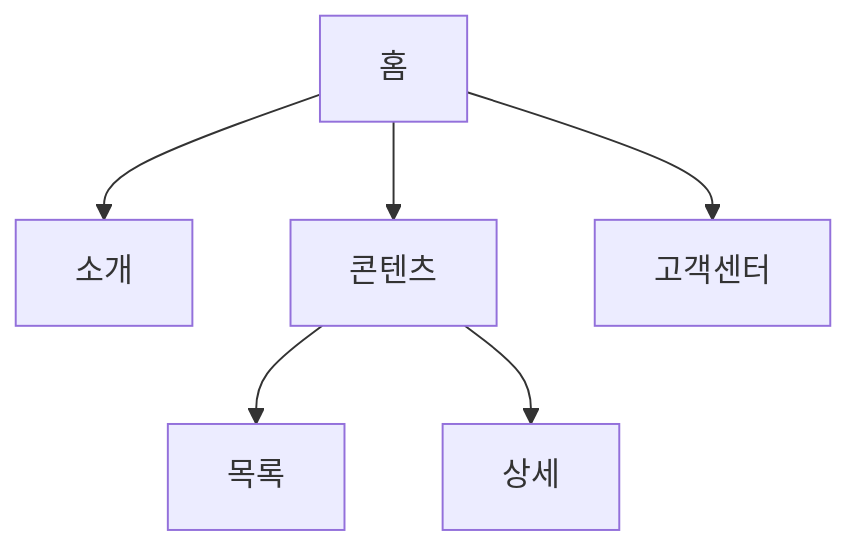

# IA Brief 템플릿 (Information Architecture)

웹서비스·랜딩·소개 사이트·포털형 UI를 기획할 때 Joi가 작성하고, TARS 구현 전 Friday가 DoD 게이트로 확인하는 정보설계(IA) 표준 양식입니다.

> 사용자가 IA를 명시하지 않아도, 웹서비스·다페이지·내비게이션이 있는 요청이면 Jarvis/Friday는 이 템플릿을 기준으로 `ia-brief.md` 초안을 자동 생성합니다. 확정되지 않은 항목은 `추정`, `미정`, `확인 필요`로 표시합니다.

## 0. 메타

- requestId:
- 프로젝트명:
- 서비스 유형: 랜딩 / 소개 사이트 / SaaS / 업무 포털 목업 / 기타
- Owner(To): Joi
- CC: TARS, C3PO, Jarvis
- 선행 산출물: Human Brief, Jarvis Strategy Brief, (선택) EVE 리서치
- 후속 산출물: Joi UX Brief, User Flow, 와이어프레임/UI, TARS 구현

## 1. 목표와 범위

- IA가 해결해야 하는 탐색 문제:
- 주요 사용자와 핵심 목적 Top 3:
- MVP에 포함할 페이지/섹션:
- Non-goals (이번 IA에서 다루지 않음):

## 2. 사이트맵 (Site Map)

페이지·섹션·모달·외부 링크를 계층으로 정리합니다. Mermaid 또는 들여쓰기 트리를 사용합니다.

```text
홈
├── 소개
│   ├── 프로젝트 개요
│   └── 핵심 가치
├── 콘텐츠
│   ├── 목록
│   └── 상세
├── 기능/도구
└── 고객센터
    ├── FAQ
    └── 문의
```



## 3. 콘텐츠 계층 (Content Hierarchy)

| 레벨 | 이름 | 설명 | 우선순위 | FEAT/REQ 연결 |
| --- | --- | --- | --- | --- |
| L1 | | 최상위 영역 | P0 | |
| L2 | | 하위 페이지/섹션 | | |
| L3 | | 상세 블록/모듈 | | |

- 홈에서 바로 노출할 정보:
- 2클릭 이내 도달해야 하는 핵심 콘텐츠:
- 깊이 제한(최대 N단계):

## 4. 내비게이션 모델 (Navigation Model)

| 영역 | 유형 | 항목 | 목적 | 비고 |
| --- | --- | --- | --- | --- |
| GNB | 글로벌 | | 주요 섹션 이동 | |
| LNB | 로컬 | | 업무/카테고리 탐색 | 업무 포털일 때 |
| Footer | 보조 | | 정책, 고객센터 | |
| Breadcrumb | 경로 | | 현재 위치 표시 | |
| In-page | 앵커/탭 | | 긴 페이지 내 이동 | |
| Utility | 유틸 | 검색, 마이, 언어 | | |

- 탐색(browse) vs 검색(search) 중 우선 전략:
- 모바일/PC 내비 차이:
- 숨김·접근 제한 메뉴:

## 5. 라벨 사전 (Label Dictionary)

메뉴, 버튼, 섹션 제목의 표준 명칭을 정의합니다. C3PO 카피와 TARS 구현이 같은 용어를 씁니다.

| UI 위치 | 표준 라벨 | 대안/금지 | 근거 |
| --- | --- | --- | --- |
| GNB | | | |
| CTA | | | |
| Footer | | | |

## 6. 사용자 흐름과 IA 연결 (User Flow ↔ IA)

User Flow는 행동 순서, IA는 정보 위치입니다. 아래 표로 연결합니다.

| 사용자 목표 | 진입점 | 경로(페이지/섹션) | 성공 화면 | 이탈/보조 경로 |
| --- | --- | --- | --- | --- |
| | | | | |

## 7. 검색·필터·정렬 (해당 시)

- 검색 대상 범위:
- 필터/정렬 축:
- 결과 없음(empty state) 처리:
- IA상 검색 결과 페이지 위치:

## 8. 크로스링크·재사용 규칙

- 페이지 간 상호 링크 규칙:
- 동일 콘텐츠의 다중 진입 허용 여부:
- 외부 링크(유튜브, 문서, API 상태) 배치 원칙:
- CTA와 본문 링크 우선순위:

## 9. IA 리스크·미결정

| ID | 항목 | 상태 | 영향 | 담당 |
| --- | --- | --- | --- | --- |
| IA-RISK-1 | | 미정/확인 필요 | | |

## 10. 완료 기준 (DoD)

- [ ] 사이트맵에 MVP 범위 페이지가 모두 포함됨
- [ ] GNB/LNB/Footer/앵커 중 필요한 내비가 정의됨
- [ ] 라벨 사전에 핵심 메뉴·CTA가 등록됨
- [ ] User Flow 또는 Joi UX Brief와 페이지 ID/라벨이 연결됨
- [ ] TARS가 구현 범위를 오해하지 않을 정도로 페이지 깊이가 제한됨
- [ ] Friday가 Review 게이트에서 IA Brief 승인

## 11. 보고 포맷

```text
To: Friday
CC: Jarvis, TARS, C3PO
Subject: [requestId] IA Brief 완료

Site Map 요약:
Navigation Model:
Label Dictionary 핵심:
User Flow 연결:
IA Risks:
다음 액션: Joi UX Brief / TARS 구현
```
