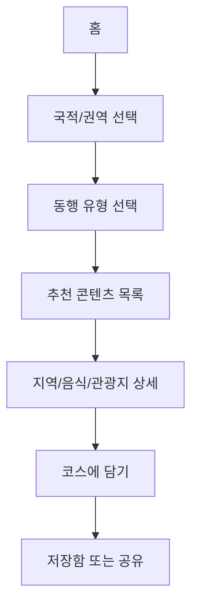
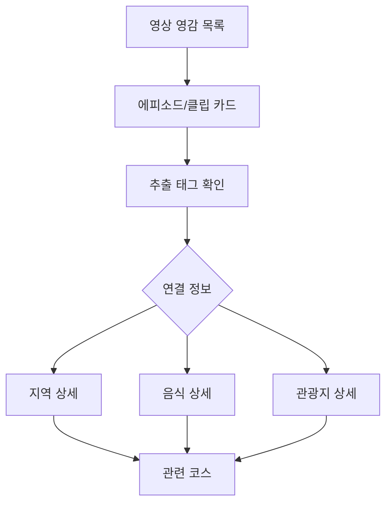
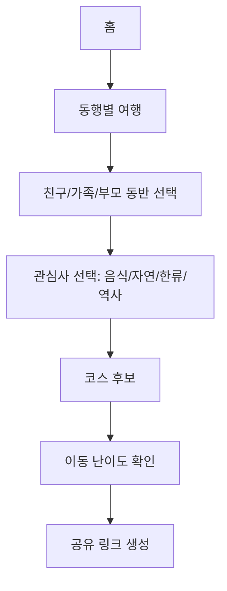
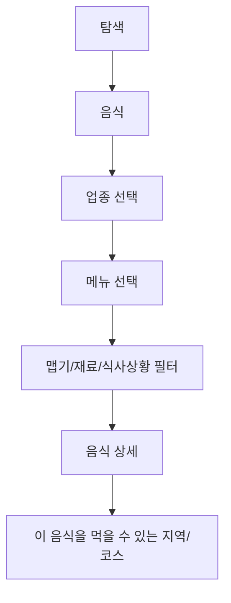
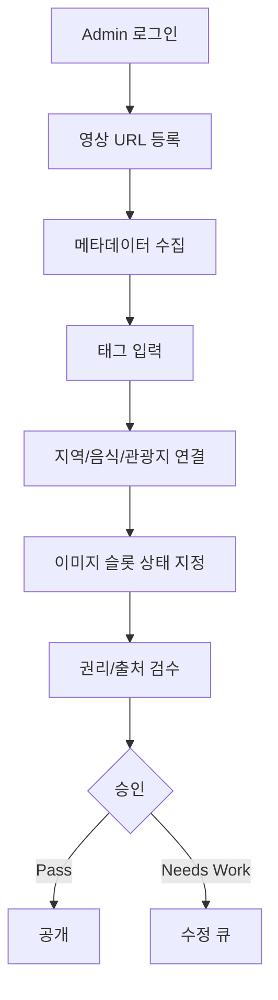
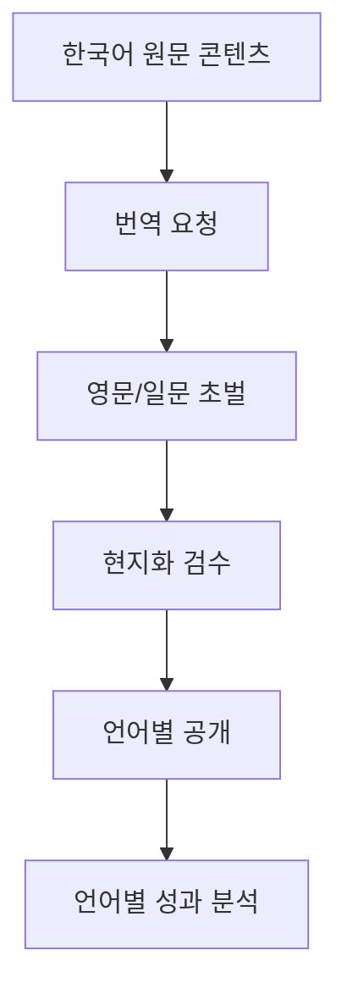
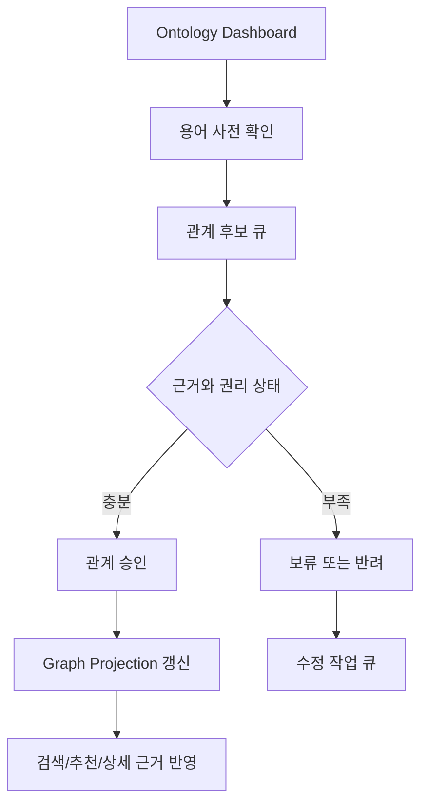

# User Flow

## 1. 외국인 여행자: 국적과 동행 기반 탐색

성공 기준:
- 사용자는 국적과 동행 유형을 선택한 뒤 2클릭 이내 상세 페이지에 도달한다.
- 상세 페이지에는 추천 이유와 공통 배너 이미지 영역이 표시된다.

## 2. 유튜브 콘텐츠에서 여행정보로 이동

성공 기준:
- 영상 카드는 원본 유튜브 링크와 분석 태그를 제공한다.
- 영상 이미지를 직접 재사용하지 않고 플레이스홀더를 사용한다.

## 3. 한국 거주 초대자: 외국인 친구 코스 제안

성공 기준:
- 코스는 이동 난이도, 식사 난이도, 소요 시간을 함께 보여준다.
- 부모 동반/아이 동반은 휴식 지점과 접근성 정보를 강조한다.

## 4. 음식 중심 탐색

성공 기준:
- 메뉴 상세는 `맛`, `먹는 방법`, `주의 재료`, `추천 동행`, `영상 영감`을 포함한다.

## 5. 운영자 콘텐츠 등록

성공 기준:
- 공개 전 권리 상태와 검수 상태가 필수다.
- 이미지가 없으면 자동으로 공통 배너 플레이스홀더가 노출된다.

## 6. 다국어 확장

성공 기준:
- 번역 콘텐츠는 원문 콘텐츠와 같은 ID 체계를 공유한다.
- 언어별 공개 상태를 독립적으로 관리한다.

## 7. 운영자 Trip Ontology 검수

성공 기준:
- 관계 후보는 `Evidence`, 출처, 권리 상태를 함께 확인한 뒤 승인한다.
- 승인되지 않은 관계는 공개 추천 이유나 사용자 화면의 단정 근거로 사용하지 않는다.
- 고아 노드, 권리 영향 콘텐츠, 커버리지 공백은 운영자 대시보드에서 우선 작업 큐로 전환된다.
