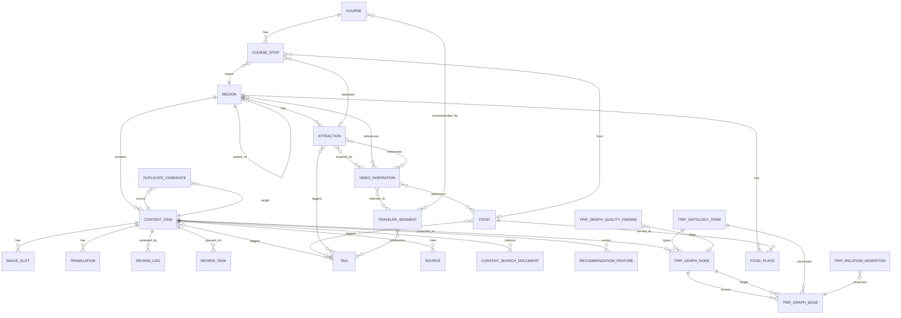

# Database Design

## 1. 핵심 엔티티

| 엔티티 | 설명 |
| --- | --- |
| `ContentItem` | 공개 콘텐츠의 공통 부모 |
| `Region` | 시/도, 시/군/구, 동/읍/면 |
| `Food` | 음식 업종과 메뉴 |
| `Attraction` | 관광지와 체험 |
| `VideoInspiration` | 유튜브 영상 기반 영감 카드 |
| `Course` | 추천 코스 |
| `TravelerSegment` | 국적/권역과 여행객 분류 |
| `Tag` | 관심사, 스타일, 계절, 난이도 |
| `ImageSlot` | 공통 배너 및 이미지 상태 |
| `Translation` | 언어별 번역 |
| `Source` | 출처와 권리 정보 |
| `ReviewLog` | 검수와 변경 기록 |
| `ReviewTask` | 운영자 검수/권리/번역 작업 큐 |
| `DuplicateCandidate` | 중복 후보와 병합 상태 |
| `ContentSearchDocument` | 공개 검색용 읽기 모델 |
| `RecommendationFeature` | 추천 계산용 feature snapshot |
| `TripGraphNode` | 온톨로지 그래프 노드 projection |
| `TripGraphEdge` | 온톨로지 그래프 관계 projection |
| `TripOntologyTerm` | 클래스, 속성, 관계 사전 |
| `TripRelationAssertion` | AI/영상 추출 관계 후보와 승인 상태 |
| `TripGraphQualityFinding` | 고아 노드, 누락 관계, 권리 영향 진단 |

## 2. ERD



## 3. 주요 테이블 초안

### `content_items`

| 필드 | 타입 | 설명 |
| --- | --- | --- |
| id | uuid | 콘텐츠 ID |
| type | enum | region, food, attraction, course, video |
| slug | text | URL slug |
| title_ko | text | 한국어 제목 |
| summary_ko | text | 한국어 요약 |
| status | enum | draft, review, published, archived |
| quality_score | numeric | 운영 품질 점수 |
| last_verified_at | timestamp | 정보 검수일 |
| canonical_key | text | 원천/표준 중복 방지 키 |
| publish_state | enum | imported, draft, editorial_review, rights_review, ready, published, needs_work, blocked, archived |
| search_index_state | enum | pending, indexed, failed |
| source_hash | text | 원천 payload 변경 감지 |

### `regions`

| 필드 | 타입 | 설명 |
| --- | --- | --- |
| id | uuid | 지역 ID |
| parent_id | uuid | 상위 지역 |
| admin_level | enum | province, city, district, neighborhood |
| name_ko | text | 한국어명 |
| lat | numeric | 위도 |
| lng | numeric | 경도 |
| travel_zone | text | 여행권역 |

### `foods`

| 필드 | 타입 | 설명 |
| --- | --- | --- |
| id | uuid | 음식 ID |
| cuisine_category | text | 업종 |
| menu_name_ko | text | 메뉴명 |
| spice_level | int | 0-5 |
| ingredients | jsonb | 재료 |
| dietary_notes | jsonb | 채식/할랄/알레르기 주의 |

### `attractions`

| 필드 | 타입 | 설명 |
| --- | --- | --- |
| id | uuid | 관광지 ID |
| region_id | uuid | 지역 |
| attraction_type | enum | history, nature, market, k_content, activity, indoor |
| duration_min | int | 예상 소요 시간 |
| booking_required | bool | 예약 필요 여부 |
| accessibility_notes | text | 접근성 메모 |

### `video_inspirations`

| 필드 | 타입 | 설명 |
| --- | --- | --- |
| id | uuid | 영상 영감 ID |
| youtube_video_id | text | 유튜브 영상 ID |
| youtube_url | text | 원본 URL |
| episode_label | text | EP 표기 |
| title_ko | text | 제목 |
| channel_name | text | 채널명 |
| rights_status | enum | link-only, licensed, blocked |
| extracted_context | jsonb | 국적, 동행, 음식, 지역 태그 |

### `image_slots`

| 필드 | 타입 | 설명 |
| --- | --- | --- |
| id | uuid | 이미지 슬롯 ID |
| content_item_id | uuid | 연결 콘텐츠 |
| slot_type | enum | hero_banner, card_thumb, inline |
| status | enum | placeholder, licensed, owned, public_license, blocked |
| alt_text_ko | text | 대체 텍스트 |
| asset_url | text | 실제 이미지 URL |
| license_note | text | 라이선스 메모 |

### `traveler_segments`

| 필드 | 타입 | 설명 |
| --- | --- | --- |
| id | uuid | 세그먼트 ID |
| segment_type | enum | nationality, region_group, companion, interest |
| name_ko | text | 한국어명 |
| locale_hint | text | 언어/권역 힌트 |
| description_ko | text | 설명 |
| caution_note | text | 고정관념 방지 메모 |

### `review_tasks`

| 필드 | 타입 | 설명 |
| --- | --- | --- |
| id | uuid | 작업 ID |
| content_item_id | uuid | 대상 콘텐츠 |
| task_type | enum | editorial, rights, translation, stale_recheck, duplicate_review |
| status | enum | open, in_progress, done, blocked |
| assignee_id | uuid | 담당자 |
| due_at | timestamp | 처리 기한 |
| priority | int | 우선순위 |

### `duplicate_candidates`

| 필드 | 타입 | 설명 |
| --- | --- | --- |
| id | uuid | 후보 ID |
| source_content_id | uuid | 기준 콘텐츠 |
| target_content_id | uuid | 비교 콘텐츠 |
| match_reason | text | 이름/좌표/외부ID/영상ID 등 |
| confidence | numeric | 유사도 |
| status | enum | pending, merged, dismissed |

### `content_search_documents`

| 필드 | 타입 | 설명 |
| --- | --- | --- |
| content_item_id | uuid | 원장 콘텐츠 |
| locale | text | 언어 |
| document_type | enum | region, food, attraction, course, video |
| title | text | 검색 제목 |
| summary | text | 검색 요약 |
| region_path | text | 지역 경로 |
| facets | jsonb | 필터 facet |
| geo | geography | 위치 검색 |
| rights_safe | bool | 권리 안전 여부 |
| last_indexed_at | timestamp | 색인 갱신일 |

### `recommendation_features`

| 필드 | 타입 | 설명 |
| --- | --- | --- |
| content_item_id | uuid | 대상 콘텐츠 |
| segment_id | uuid | 추천 세그먼트 |
| feature_version | text | feature 버전 |
| weights | jsonb | 국적/동행/관심사/계절 가중치 |
| reason_ko | text | 한국어 추천 이유 |
| computed_at | timestamp | 계산일 |

### `trip_graph_nodes`

| 필드 | 타입 | 설명 |
| --- | --- | --- |
| id | uuid | 그래프 노드 ID |
| entity_type | enum | content, region, food, attraction, video, segment, source, image, rights, evidence |
| entity_id | uuid | 원장 엔티티 ID |
| ontology_class | text | 온톨로지 클래스 |
| label_ko | text | 노드 라벨 |
| properties | jsonb | 화면 표시/필터용 속성 |
| quality_state | enum | ok, warning, risk, orphan |

### `trip_graph_edges`

| 필드 | 타입 | 설명 |
| --- | --- | --- |
| id | uuid | 그래프 관계 ID |
| source_node_id | uuid | 시작 노드 |
| target_node_id | uuid | 대상 노드 |
| predicate | text | 관계명 |
| confidence | numeric | 신뢰도 |
| evidence_id | uuid | 근거 |
| approval_state | enum | proposed, approved, rejected, held |

### `trip_ontology_terms`

| 필드 | 타입 | 설명 |
| --- | --- | --- |
| id | uuid | 용어 ID |
| term_type | enum | class, property, relation |
| term_key | text | 표준 키 |
| label_ko | text | 한국어 라벨 |
| description_ko | text | 설명 |
| status | enum | active, deprecated, draft |

### `trip_relation_assertions`

| 필드 | 타입 | 설명 |
| --- | --- | --- |
| id | uuid | 관계 주장 ID |
| source_ref | text | 원천 |
| subject_node_id | uuid | 주어 노드 |
| predicate | text | 관계 |
| object_node_id | uuid | 목적어 노드 |
| assertion_status | enum | proposed, approved, rejected, held |
| review_task_id | uuid | 검수 작업 |

### `trip_graph_quality_findings`

| 필드 | 타입 | 설명 |
| --- | --- | --- |
| id | uuid | 진단 ID |
| finding_type | enum | orphan_node, missing_evidence, rights_risk, duplicate_relation, taxonomy_drift |
| node_id | uuid | 관련 노드 |
| edge_id | uuid | 관련 관계 |
| severity | enum | low, medium, high |
| status | enum | open, resolved, ignored |

## 4. 데이터 품질 규칙

- 공개 콘텐츠는 최소 1개 이상의 출처를 가진다.
- 상세 페이지 콘텐츠는 최소 1개의 `hero_banner` 이미지 슬롯을 가진다.
- `placeholder` 상태 이미지는 실제 이미지 URL을 가질 수 없다.
- 유튜브 기반 콘텐츠는 `rights_status=link-only`가 기본값이다.
- `last_verified_at`이 90일 이상 지나면 검수 큐에 들어간다.
- 국적/동행 추천은 `recommendation_reason`을 함께 저장한다.
- `canonical_key`는 콘텐츠 유형별로 유니크해야 한다.
- 공개 상태가 `published`인 콘텐츠는 `content_search_documents`가 1개 이상 있어야 한다.
- `search_index_state=failed` 콘텐츠는 운영 알림 대상이다.
- 권리 상태가 `blocked`인 이미지가 연결된 콘텐츠는 공개할 수 없다.
- 중복 후보가 `confidence >= 0.85`이면 CMS 작업 큐에 자동 등록한다.
- `recommendedFor` 그래프 관계는 승인된 `Evidence`가 없으면 공개 추천 근거로 사용할 수 없다.
- `approval_state=proposed` 관계는 운영 대시보드에서만 보이고 공개 서비스에는 반영하지 않는다.
- `quality_state=orphan` 노드는 7일 이상 방치되면 `review_tasks`에 자동 등록한다.
- `rights_risk` finding이 열린 콘텐츠는 권리 검수 전까지 이미지 교체 또는 공개 상태 재검토가 필요하다.

## 5. 효율적 관리 원칙

- 원장 DB는 정확성과 감사 가능성을 우선한다.
- 공개 검색은 읽기 모델과 Search Index를 사용해 조인 비용을 낮춘다.
- 원천 수집 데이터는 staging에 보관하고, 운영자 검수 후 표준 taxonomy로 승격한다.
- 지역 트리, 인기 태그, 홈 추천은 캐시한다.
- 검수, 권리, 번역, 중복 처리는 `review_tasks` 큐로 운영한다.
- 상세 설계는 `09-content-db-management-strategy.md`를 따른다.
- 지식 그래프와 온톨로지 운영은 `10-trip-ontology-dashboard-plan.md`를 따른다.

## 6. Supabase 물리 스키마 배치

이 문서의 테이블명은 논리명이다. Supabase에 실제 생성할 때는 프로젝트 전용 스키마를 붙인다.

| 항목 | 기준 |
| --- | --- |
| 권장 스키마 | `korea_travel_content` |
| 사용 지양 | `public` 신규 앱 테이블 |
| 클라이언트 접근 | Supabase JS `db.schema = "korea_travel_content"` |
| SQL/migration | 항상 `korea_travel_content.table_name` 형태 |
| RLS | 모든 공개/운영 테이블에서 활성화 |
| 상세 절차 | `12-supabase-schema-separation-guide.md` |

예시:

```sql
CREATE TABLE IF NOT EXISTS korea_travel_content.trip_ontology_terms (
  id uuid PRIMARY KEY DEFAULT gen_random_uuid(),
  term_type text NOT NULL,
  term_key text NOT NULL,
  label_ko text NOT NULL,
  description_ko text,
  status text NOT NULL DEFAULT 'draft',
  created_at timestamptz NOT NULL DEFAULT now(),
  UNIQUE (term_type, term_key)
);

ALTER TABLE korea_travel_content.trip_ontology_terms ENABLE ROW LEVEL SECURITY;
```

온톨로지 선행 트랙의 `trip_ontology_terms`, `trip_relation_assertions`, `trip_graph_nodes`, `trip_graph_edges`도 모두 같은 스키마에 둔다.
