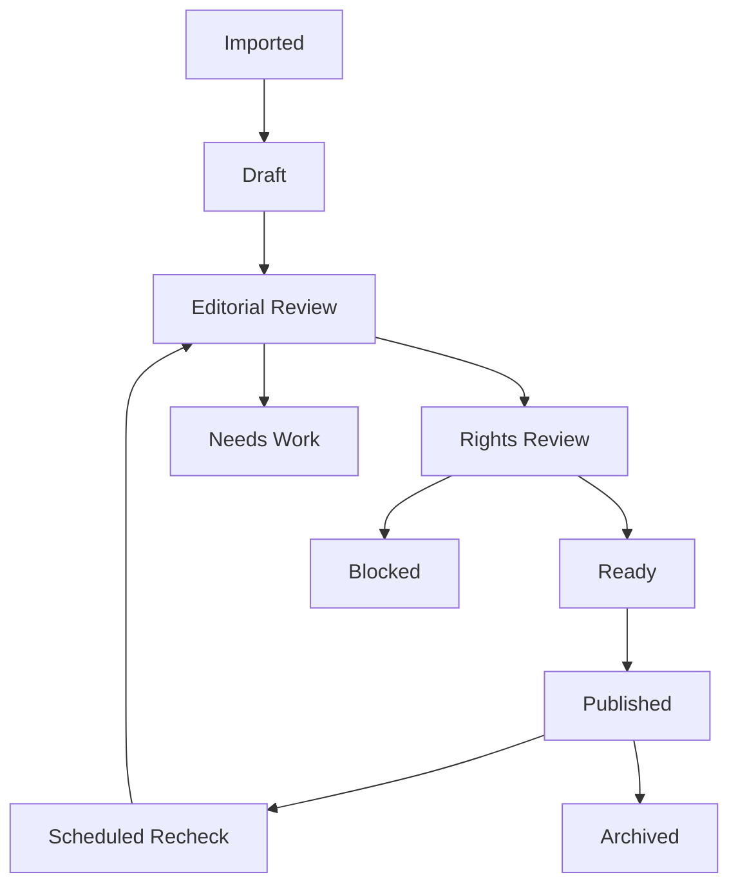

# Content DB Management Strategy

## 1. 목적

여행정보 콘텐츠 서비스는 지역, 음식, 관광지, 영상 영감, 이미지, 번역, 출처, 검수 상태가 계속 늘어난다. 효율적인 DB 관리를 위해 `콘텐츠 작성 편의`, `검색 성능`, `권리/검수 추적`, `다국어 확장`, `운영 비용`을 동시에 고려한다.

## 2. 핵심 결론

- 콘텐츠의 기준 정보는 정규화한다. `Region`, `Food`, `Attraction`, `VideoInspiration`, `Source`, `ImageSlot`, `Translation`은 별도 테이블로 관리한다.
- 콘텐츠 운영 편의 정보는 JSONB로 보조한다. 영상에서 추출한 임시 태그, 운영자 메모, 원천별 raw payload는 `jsonb`로 보관하되 공개 검색의 기준값으로 직접 쓰지 않는다.
- 검색과 추천은 읽기 최적화 레이어를 둔다. 공개 웹은 운영 DB를 직접 복잡하게 조인하지 않고 `content_search_documents`, `recommendation_features`, Search Index를 사용한다.
- CMS 작업은 상태 머신으로 관리한다. 초안, 검수, 승인, 발행, 만료, 보류 상태를 명확히 두고 작업 큐를 만든다.
- 이미지와 권리 정보는 콘텐츠와 분리한다. 실제 이미지가 바뀌어도 콘텐츠 URL과 본문은 흔들리지 않아야 한다.
- 다국어는 원문과 번역을 분리한다. 한국어 원문 콘텐츠가 SSOT이며 영문/일문은 번역 상태와 품질 점수를 가진다.
- Supabase 사용 시 물리 테이블은 `public`이 아니라 프로젝트 전용 스키마 `korea_travel_content`에 둔다.

## 3. 권장 DB 계층

```text
Operational DB: PostgreSQL + PostGIS
  - 정규화된 콘텐츠 원장
  - 권리/검수/감사 로그
  - CMS 작업 큐

Search Layer: Meilisearch 또는 OpenSearch
  - 공개 검색 문서
  - 자동완성, 필터 facet
  - 국적/동행/지역/음식/관광지 검색

Cache Layer: Redis 또는 CDN cache
  - 홈 추천, 인기 필터, 지역 트리
  - 콘텐츠 상세 API 캐시

Object Storage
  - 실제 이미지 파일
  - 원천 데이터 스냅샷
  - PDF/CSV 수집 원본

Analytics Store
  - 조회, 검색, 저장, 클릭 이벤트
  - 추천 가중치 보정용 집계
```

## 4. 정규화와 JSONB 사용 기준

| 데이터 | 관리 방식 | 이유 |
| --- | --- | --- |
| 지역 행정구역 | 정규화 | 계층, 지도, 필터 정확성 필요 |
| 음식 메뉴/업종 | 정규화 | 필터와 다국어 번역 기준값 |
| 관광지 | 정규화 | 위치, 운영정보, 출처 검수 필요 |
| 태그 | 정규화 + 연결 테이블 | facet 검색과 추천 가중치에 필요 |
| 영상 raw metadata | JSONB | 원천 구조가 변할 수 있음 |
| 영상 추출 임시 태그 | JSONB staging 후 정규 태그 승격 | 운영자 검수 전까지 임시값 |
| 운영자 메모 | JSONB 또는 별도 note table | 화면별 유연성 |
| 추천 feature snapshot | JSONB + 집계 테이블 | 실험과 버전별 비교 |
| 번역 | 별도 Translation 테이블 | 언어별 상태와 품질 관리 |

## 5. 콘텐츠 수명주기



상태 정의:

| 상태 | 의미 | 공개 여부 |
| --- | --- | --- |
| imported | 외부 원천에서 수집됨 | 비공개 |
| draft | 운영자 편집 중 | 비공개 |
| editorial_review | 내용 검수 | 비공개 |
| rights_review | 출처/이미지/권리 검수 | 비공개 |
| ready | 공개 대기 | 비공개 또는 예약 공개 |
| published | 공개 | 공개 |
| needs_work | 수정 필요 | 비공개 또는 기존 공개 유지 |
| blocked | 권리/품질 문제 | 비공개 |
| archived | 보관 | 비공개 |

## 6. 중복 방지 전략

### Canonical Key

콘텐츠마다 원천별 중복 판단 키를 둔다.

| 콘텐츠 | canonical key 예 |
| --- | --- |
| 유튜브 영상 | `youtube:{videoId}` |
| 지역 | `region:{adminCode}` |
| 관광지 | `place:{provider}:{externalPlaceId}` |
| 음식 메뉴 | `food:{normalizedMenuName}:{category}` |
| 이미지 | `image:{source}:{assetHash}` |

### 중복 병합 규칙

- 같은 canonical key는 기본적으로 1개 원장만 허용한다.
- 이름이 비슷하지만 위치가 다른 장소는 병합하지 않는다.
- 음식 메뉴는 표준 메뉴와 별칭을 분리한다. 예: `짜장면`, `자장면`.
- 영상 기반 태그는 바로 원장에 병합하지 않고 staging에서 검수한다.

## 7. 검색 최적화

공개 검색은 다음 읽기 모델을 만든다.

### `content_search_documents`

| 필드 | 설명 |
| --- | --- |
| content_id | 원장 콘텐츠 ID |
| document_type | region, food, attraction, course, video |
| title | 현재 언어 제목 |
| summary | 현재 언어 요약 |
| region_path | 시/도 > 시/군/구 > 동 |
| facets | 국적, 동행, 음식, 관광지 유형, 계절 |
| geo | 위도/경도 |
| quality_score | 품질 점수 |
| rights_safe | 공개 권리 안전 여부 |
| last_verified_at | 최종 검수일 |

운영 DB 변경 후 검색 문서를 비동기로 갱신한다.

## 8. 인덱스와 성능 기준

| 대상 | 권장 인덱스 |
| --- | --- |
| `content_items(status, type, updated_at)` | CMS 목록 |
| `regions(parent_id, admin_level)` | 지역 트리 |
| `regions` geometry/geography | 지도 반경 검색 |
| `content_tags(tag_id, content_item_id)` | 필터 facet |
| `translations(content_item_id, locale, status)` | 다국어 상태 |
| `image_slots(content_item_id, slot_type, status)` | 이미지 상태 검수 |
| `sources(source_type, external_id)` | 원천 중복 방지 |
| `review_tasks(status, assignee_id, due_at)` | 운영자 작업 큐 |
| `audit_logs(entity_type, entity_id, created_at)` | 감사 추적 |

운영 기준:

- 공개 API는 복잡한 N:M 조인을 직접 수행하지 않는다.
- 홈/인기/지역 트리 API는 캐시 TTL을 둔다.
- CMS 목록은 페이지네이션과 필터 인덱스를 필수로 한다.
- 검색 facet은 Search Layer에서 처리한다.

## 9. 운영자 CMS 효율화

필수 관리 화면:

| 화면 | 목적 |
| --- | --- |
| 콘텐츠 작업 큐 | 검수 대기, 권리 확인, 오래된 정보 자동 배정 |
| 중복 후보 병합 | 유사 지역/관광지/영상 후보 비교 |
| 태그 승격 | 영상 raw tag를 표준 태그로 승격 |
| 이미지 슬롯 관리 | placeholder, licensed, owned, blocked 상태 변경 |
| 번역 상태판 | ko/en/ja 번역 진행률과 품질 점수 |
| 출처/권리 대장 | 출처, 라이선스, 만료일, 사용범위 |
| 데이터 품질 대시보드 | 누락 필드, 오래된 검수, 검색 미노출 콘텐츠 |

## 10. 데이터 품질 점수

`quality_score`는 공개 정렬과 운영 큐 우선순위에 사용한다.

```text
quality_score =
  requiredFieldScore
  + sourceScore
  + verificationFreshnessScore
  + rightsSafetyScore
  + localizationScore
  + engagementScore
  - stalePenalty
  - rightsRiskPenalty
```

필수 공개 조건:

- 제목과 요약이 있다.
- 최소 1개 출처가 있다.
- 권리 상태가 안전하다.
- 상세 페이지용 `hero_banner` 이미지 슬롯이 있다.
- 실제 이미지가 없으면 `placeholder`와 대체 텍스트가 있다.
- 지역/음식/관광지 중 최소 1개 분류축에 연결된다.

## 11. 백업, 보관, 삭제

- 운영 DB는 일 단위 백업, 월 단위 장기 보관을 둔다.
- 원천 수집 payload는 object storage에 스냅샷으로 보관하되 공개 데이터와 분리한다.
- 감사 로그는 최소 1년 이상 보관한다.
- 이미지 라이선스 만료 또는 권리 철회 시 공개 노출을 즉시 차단할 수 있어야 한다.
- 개인정보 기능을 도입하면 콘텐츠 DB와 사용자 DB를 논리적으로 분리한다.

## 12. 권장 구현 순서

| 순서 | 작업 |
| --- | --- |
| 1 | 콘텐츠 원장 테이블과 표준 taxonomy 확정 |
| 2 | 권리/출처/이미지 슬롯 상태 모델 구현 |
| 3 | CMS 작업 큐와 검수 상태 머신 구현 |
| 4 | 검색 문서 읽기 모델 생성 |
| 5 | 중복 방지 canonical key와 병합 화면 구현 |
| 6 | 다국어 Translation 상태판 구현 |
| 7 | 품질 점수와 오래된 정보 재검수 배치 구현 |
| 8 | 행동 데이터 기반 추천 feature snapshot 구현 |

## 13. Supabase 스키마 운영 원칙

상세 절차는 `12-supabase-schema-separation-guide.md`를 따른다.

- 운영 DB가 Supabase일 경우 모든 원장, 작업 큐, 검색 읽기 모델, 온톨로지 projection 테이블은 `korea_travel_content` 스키마에 생성한다.
- `public`은 신규 앱 테이블 생성에 사용하지 않는다.
- Data API 사용 전 Supabase Dashboard에서 `korea_travel_content`를 Exposed schemas에 등록한다.
- Supabase JS client는 `db.schema` 옵션으로 프로젝트 전용 스키마를 지정한다.
- migration과 SQL Editor에서는 항상 `korea_travel_content.table_name` 형태로 스키마를 명시한다.
- RLS가 없는 테이블은 공개 client에서 접근하지 않는다.
